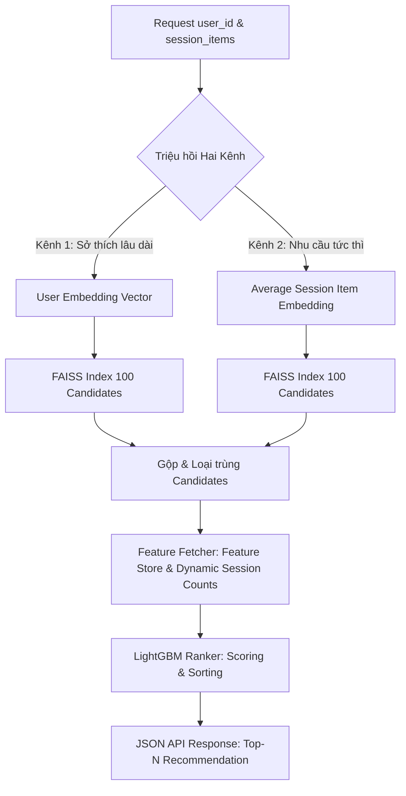

# Two-Stage Recommender System with Dual-Channel Recall & Point-in-time Session Dynamics

Hệ thống gợi ý sản phẩm Hai Giai Đoạn (Two-Stage) tiêu chuẩn công nghiệp sử dụng **PyTorch** cho khâu Triệu hồi (Recall), **FAISS** cho khâu Tìm kiếm Vector siêu tốc, và **LightGBM** cho khâu Xếp hạng chi tiết (Ranking). 

Hệ thống đã được nâng cấp toàn diện với cơ chế **Triệu hồi Hai Kênh (Dual-Channel Recall)** tích hợp bối cảnh phiên mua sắm thời gian thực và đặc trưng point-in-time kháng lỗi, mang lại sự kết hợp tối ưu giữa **Độ trễ thấp (<50ms)** và **Độ chính xác cá nhân hóa cao**.

---

## 🚀 Tính Năng Nổi Bật (Key Features)

*   **Triệu hồi Song song Hai Kênh (Dual-Channel Recall):**
    *   *Kênh 1 (Long-term Preference):* Truy vết sở thích dài hạn của người dùng bằng cách quét FAISS lân cận gần nhất dựa trên User Embedding (từ PyTorch Matrix Factorization).
    *   *Kênh 2 (Current Session Needs):* Phân tích các sản phẩm tương tác gần nhất trong phiên mua sắm, tính toán **Vector trung bình (Average Session Embedding)** và quét FAISS tìm các ứng viên tương tự bối cảnh tức thì.
*   **Đặc trưng Phiên Point-in-time (No-Leakage Session Features):**
    *   `user_session_interaction_count`: Đo lường mức độ tích cực hành vi của user trong phiên hiện tại lũy tiến theo thời gian.
    *   `item_session_popularity`: Đo lường độ thịnh hành của sản phẩm dựa trên số lượng phiên độc nhất (unique sessions) để loại bỏ nhiễu do click spam.
    *   *Đặc trưng Chỉ thị Kênh (`recalled_by_...`):* Bổ trợ tín hiệu nguồn gốc ứng viên cho LightGBM Ranker đưa ra quyết định xếp hạng chính xác nhất.
*   **Suy luận Kháng Lỗi & Linh Hoạt (Fault-Tolerant Dynamic Serving):**
    *   LightGBM Ranker tự động đọc cấu trúc đặc trưng từ tệp mô hình đã huấn luyện (`self.model.feature_name()`).
    *   Tự động phát hiện và điền khuyết/bù đắp cột đặc trưng bị thiếu tại thời điểm gọi API, loại bỏ hoàn toàn lỗi crash do Feature Mismatch.
*   **API thời gian thực siêu tốc:** API FastAPI tải sẵn mô hình và bảng đặc trưng lên bộ nhớ RAM lúc khởi động (In-Memory Feature Tables), đảm bảo thời gian phản hồi cực thấp (<50ms).

---

## 📁 Cấu Trúc Mã Nguồn (Codebase Structure)

```
EDA_project/
├── artifact/                  # Thư mục lưu trữ báo cáo đồng bộ và kế hoạch triển khai
├── explain/                   # Thư mục giải thích chuyên sâu kỹ thuật cho từng Phase 1-5
├── notebooks/                 # Vở bài tập Jupyter Notebook phân tích EDA và thử nghiệm
├── models_store/              # Lưu trữ tệp mô hình huấn luyện (PyTorch & LightGBM)
├── data/
│   ├── raw/                   # Chứa tệp dữ liệu thô (ví dụ: 2019-Oct.csv)
│   ├── sessions/              # Chứa Parquet dữ liệu hành vi đã phân phiên
│   └── feature_store/         # In-Memory Feature Store tra cứu nhanh cho Serving
└── src/
    ├── config.py              # Thống nhất tham số và đặc trưng (Single Source of Truth)
    ├── data_pipeline/         # Sessionization, Pseudo Labeling và Point-in-time Featurization
    ├── recall_model/          # Mô hình Matrix Factorization, huấn luyện Focal Loss
    ├── ranking_model/         # Mô hình LightGBM Ranker, metrics NDCG@K/MRR
    └── serving/               # FAISS Index và Recommendation Pipeline điều phối hai kênh
```

---

## ⚙️ Quy Trình Vận Hành Thời Gian Thực (Architecture Workflow)



---

## 🛠️ Hướng Dẫn Sử Dụng (Quick Start)

### 1. Thiết lập Môi trường
Dự án sử dụng công cụ quản lý package thế hệ mới bằng Rust **`uv`** để tối ưu hóa tốc độ và độ tin cậy:
```bash
# Đồng bộ hóa môi trường và cài đặt mọi thư viện phụ thuộc từ uv.lock
uv sync
```

### 2. Tải Dữ liệu Thô
Tải tệp dữ liệu hành vi thương mại điện tử `2019-Oct.csv` (ví dụ từ tập dữ liệu REES46 trên Kaggle) và đặt vào thư mục:
`data/raw/2019-Oct.csv`

### 3. Huấn luyện Luồng End-to-End
Kích hoạt toàn bộ đường ống dữ liệu, huấn luyện mô hình triệu hồi và mô hình xếp hạng chỉ với một câu lệnh:
```bash
uv run python main_train.py
```
*Tác vụ này sẽ chạy tuần tự qua:*
1.  *Data Pipeline:* Chia phiên (Sessionization 30 phút), chuẩn hóa Price, gán điểm Implicit feedback (view=0.1, cart=0.5, purchase=1.0) và trích xuất đặc trưng Point-in-time.
2.  *Recall Stage:* Lấy mẫu âm tính (Negative Sampling 1:4), huấn luyện mô hình PyTorch MF với Focal Loss và xuất Item Embeddings.
3.  *Ranking Stage:* Nạp động đặc trưng từ `config.py`, chia train/test theo thời gian và huấn luyện mô hình LightGBM Ranker.

### 4. Khởi động API Server Phục vụ
Bật máy chủ FastAPI hiệu năng cao để tiếp nhận các truy vấn gợi ý thời gian thực:
```bash
uv run python main_serve.py
```
API Server sẽ khởi chạy tại tọa độ: `http://127.0.0.1:8000`

---

## 🪟 Hướng Dẫn Sử Dụng API Endpoints

### 1. Gợi ý cá nhân hóa lâu dài (Chỉ chạy Kênh 1)
Sử dụng khi khách hàng mới truy cập phiên và chưa thực hiện tương tác nào:
*   **Request URL:** `GET http://127.0.0.1:8000/recommend/{user_id}`
*   **Ví dụ cURL:**
    ```bash
    curl -X GET "http://127.0.0.1:8000/recommend/10005"
    ```

### 2. Gợi ý bối cảnh phiên thời gian thực (Kích hoạt Triệu hồi Hai Kênh)
Sử dụng khi khách hàng đang có các tương tác tích cực trong phiên. Ví dụ họ đang xem các sản phẩm có ID `5700030` và `5700140`:
*   **Request URL:** `GET http://127.0.0.1:8000/recommend/{user_id}?session_items=ID1,ID2,...`
*   **Ví dụ cURL:**
    ```bash
    curl -X GET "http://127.0.0.1:8000/recommend/10005?session_items=5700030,5700140"
    ```
    *Hệ thống sẽ lập tức tính Vector trung bình phiên của 2 sản phẩm này, truy vấn thêm 100 ứng viên từ FAISS, gộp kênh xếp hạng, gán nhãn chỉ thị kênh và ưu tiên các sản phẩm tương đồng lên trên cùng của danh sách phản hồi.*

---

## 📘 Tài Liệu Tham Khảo Thêm
Để hiểu chi tiết về toán học, thiết kế kỹ thuật của từng giai đoạn và quá trình đồng bộ hóa, vui lòng tham khảo các thư mục tài liệu:
*   **[Giải thích Kỹ thuật Chuyên sâu các Phase](file:///D:/programing/project/EDA_project/explain/)**
*   **[Báo cáo và Kế hoạch Đồng bộ hóa trong Project](file:///D:/programing/project/EDA_project/artifact/)**
