# Kịch Bản Thuyết Trình: Hệ Thống Gợi Ý Sản Phẩm Hai Giai Đoạn (40 Slide Tinh Gọn)

Tài liệu này phác thảo nội dung **siêu tinh gọn (ultra-minimalist)** và **một ý duy nhất mỗi slide** của **39 Slide** thuyết trình. Cấu trúc cực kỳ chi tiết này phân rã toàn bộ kiến thức kỹ thuật phức tạp thành các khái niệm đơn lẻ, súc tích, đọc vào là hiểu ngay lập tức. Bài trình bày tương tác đã được cập nhật tại tệp `presentation.html` ở gốc dự án.

---

## 📊 Sơ Đồ Cấu Trúc 39 Slide Độc Lập

```mermaid
graph TD
    subgraph Giai đoạn Mở đầu & Lộ trình
        S1[Slide 1: Tiêu Đề] --> S2[Slide 2: Lộ Trình 5 Phase]
    end
    
    subgraph Phase 1: EDA & Setup
        S2 --> S3[Slide 3: Thách thức Sparsity]
        S3 --> S4[Slide 4: Thách thức Lệch Hành Vi]
        S4 --> S5[Slide 5: Triết Lý Implicit Feedback]
        S5 --> S6[Slide 6: Chi Tiết Trọng Số Hành Vi]
    end
    
    subgraph Phase 2: Pipeline Dữ Liệu
        S6 --> S7[Slide 7: Phân Phiên Sessionization]
        S7 --> S8[Slide 8: Hiểm Họa Rò Rỉ Dữ Liệu]
        S8 --> S9[Slide 9: Nguyên Tắc Point-in-Time]
        S9 --> S10[Slide 10: User - Tần Suất Lịch Sử]
        S10 --> S11[Slide 11: User - Tần Suất Phiên]
        S11 --> S12[Slide 12: Item - Sức Hút Sản Phẩm]
        S12 --> S13[Slide 13: Item - Giá Lũy Tiến]
        S13 --> S14[Slide 14: Item - Độ Nóng Phiên]
        S14 --> S15[Slide 15: Context - Độ Sâu Phiên]
        S15 --> S16[Slide 16: Context - Khung Giờ & Ngày]
    end
    
    subgraph Phase 3: Recall Stage
        S16 --> S17[Slide 17: Quy Trình Vận Hành Thời Gian Thực]
        S17 --> S18[Slide 18: Tổng Quan Triệu Hồi]
        S18 --> S19[Slide 19: Kênh 1 - Gu Lâu Dài]
        S19 --> S20[Slide 20: Kênh 2 - Nhu Cầu Phiên]
        S20 --> S21[Slide 21: Huấn Luyện MF - Kiến Trúc]
        S21 --> S22[Slide 22: Huấn Luyện MF - Khởi Tạo Xavier]
        S22 --> S23[Slide 23: Huấn Luyện MF - Lấy Mẫu Âm Tính]
        S23 --> S24[Slide 24: Huấn Luyện MF - Focal Loss]
    end
    
    subgraph Phase 4: Ranking Stage
        S24 --> S25[Slide 25: Tổng Quan Xếp Hạng]
        S25 --> S26[Slide 26: Cắt Dữ Liệu Time-Based]
        S26 --> S27[Slide 27: Trọng Số Mẫu LGBM]
        S27 --> S28[Slide 28: Tối Ưu NDCG & MRR]
        S28 --> S29[Slide 29: Đồng Bộ Đặc Trưng Động]
    end
    
    subgraph Phase 5: API Phục Vụ & Kết quả
        S29 --> S30[Slide 30: Serving In-Memory RAM]
        S30 --> S31[Slide 31: Serving Kháng Lỗi API]
        S31 --> S32[Slide 32: Serving Giải Quyết Cold-Start]
        S32 --> S33[Slide 33: Cấu Hình Data Pipeline]
        S33 --> S34[Slide 34: Cấu Hình Recall PyTorch]
        S34 --> S35[Slide 35: Cấu Hình Ranking LightGBM]
        S35 --> S36[Slide 36: Kết Quả Đánh Giá Recall]
        S36 --> S37[Slide 37: Kết Quả Đánh Giá Ranking]
        S37 --> S38[Slide 38: Tổng Đạt Mục Tiêu Độ Trễ]
        S38 --> S39[Slide 39: Breakdown Độ Trễ API]
        S39 --> S40[Slide 40: Tổng Kết Ưu Điểm System]
    end
```

---

### 🌟 Slide 1: Tiêu Đề & Tổng Quan
*   **Ý chính:** Giới thiệu hệ thống gợi ý Two-Stage công nghiệp siêu tốc.
*   **Nội dung súc tích:**
    *   **Hệ thống gợi ý Two-Stage:** Chuẩn mực kiến trúc công nghiệp quy mô lớn.
    *   **Mục tiêu:** Cân bằng hoàn hảo giữa tốc độ phục vụ (<50ms) và độ chính xác gợi ý.
    *   **Công nghệ cốt lõi:** PyTorch Matrix Factorization & FAISS (Recall) + LightGBM GBDT (Ranking).

### 📅 Slide 2: Lộ Trình Phát Triển (Timeline)
*   **Ý chính:** Tổng quan 5 Phase chính gắn kết mạch logic của dự án.
*   **Nội dung súc tích:** Sơ đồ ngang tương tác (nhấp chuột để nhảy slide):
    *   **Phase 1:** EDA & Thiết kế chiến lược xử lý dữ liệu.
    *   **Phase 2:** Pipeline & Đặc trưng Point-in-time.
    *   **Phase 3:** Recall hai kênh PyTorch & FAISS Index.
    *   **Phase 4:** Ranking xếp hạng chi tiết LightGBM.
    *   **Phase 5:** Phục vụ Serving API, đánh giá chất lượng.

---

## 🔍 Phase 1: EDA & Setup

### 📉 Slide 3: Thách Thức Dữ Liệu - Matrix Sparsity
*   **Ý chính:** Độ thưa thớt của ma trận tương tác User-Item đạt mức 99.99%.
*   **Nội dung súc tích:**
    *   **Thực trạng:** Khách hàng chỉ xem hoặc mua một vài món đồ trên hàng chục nghìn sản phẩm.
    *   **Lỗi sụp đổ:** Các thuật toán Collaborative Filtering truyền thống mất độ chính xác hoặc crash.
    *   **Giải pháp:** Học một không gian biểu diễn ẩn (Embedding Space) 64 chiều để thu hẹp khoảng cách.

### 📊 Slide 4: Thách Thức Dữ Liệu - Lệch Lớp Hành Vi
*   **Ý chính:** Sự chênh lệch cực đoan giữa các hành vi Xem, Bỏ giỏ và Mua hàng.
*   **Nội dung súc tích:**
    *   **Lượt Xem (Views):** Chiếm áp đảo **96.8%** lượng tương tác.
    *   **Thêm Giỏ (Carts):** Chiếm **2.3%** lượng tương tác.
    *   **Mua Hàng (Purchases):** Chỉ chiếm vỏn vẹn **0.9%**.
    *   **Hậu quả:** Mô hình dễ bị bão hòa bởi lượt xem ngẫu nhiên, bỏ qua tín hiệu mua sắm thực tế.

### ⚖️ Slide 5: Triết Lý Tối Ưu - Implicit Feedback
*   **Ý chính:** Chuyển đổi nhãn nhị phân cứng nhắc thành thang điểm phản hồi ngầm định.
*   **Nội dung súc tích:**
    *   **Hạn chế nhãn cứng:** Phân biệt Nhãn 0 và 1 không phản ánh đúng ý đồ thực sự của khách hàng.
    *   **Triết lý:** Gán trọng số chất lượng cho từng loại tương tác để hướng mô hình tối ưu hành vi có giá trị nhất.
    *   **Mục tiêu:** Tăng doanh thu bằng cách ưu tiên các chuyển đổi thực tế (Carts & Purchases).

### 🏷️ Slide 6: Chi Tiết Trọng Số Hành Vi
*   **Ý chính:** Định nghĩa cụ thể thang điểm quy đổi hành vi.
*   **Nội dung súc tích:**
    *   **View (Xem):** Điểm **0.1** (Tín hiệu yếu, độ nhiễu cao).
    *   **Cart (Giỏ hàng):** Điểm **0.5** (Ý định mua sắm mạnh mẽ).
    *   **Purchase (Mua hàng):** Điểm **1.0** (Tín hiệu chuyển đổi tối thượng).

---

## ⛓️ Phase 2: Pipeline Dữ Liệu & Đặc Trưng Point-in-Time

### 🕒 Slide 7: Phân Phiên Hành Vi (Sessionization)
*   **Ý chính:** Gom nhóm hành động tức thời dựa trên khoảng nghỉ 30 phút.
*   **Nội dung súc tích:**
    *   **Ngưỡng ngắt phiên:** **30 phút không hoạt động** liên tục của người dùng.
    *   **Mục tiêu:** Bắt trọn nhu cầu tức thì, thay đổi liên tục của khách hàng ngay trong phiên truy cập hiện tại.
    *   **Ý nghĩa:** Làm đầu vào cho Kênh gợi ý nhu cầu tức thời thời gian thực.

### ⚠️ Slide 8: Hiểm Họa Rò Rỉ Dữ Liệu (Time-Travel Leakage)
*   **Ý chính:** Dùng dữ liệu tương lai để dự đoán quá khứ làm vô hiệu hóa mô hình khi chạy thực tế.
*   **Nội dung súc tích:**
    *   **Mô tả:** Gán đặc trưng tổng hợp của toàn bộ lịch sử vào một mốc thời gian ở giữa tập dữ liệu.
    *   **Biểu hiện:** Điểm huấn luyện (Train Metric) siêu cao nhưng khi Serving thực tế gợi ý cực kỳ tệ.
    *   **Yêu cầu:** Triệt tiêu hoàn toàn bất kỳ thông tin nào xảy ra sau sự kiện hiện tại.

### 🛡️ Slide 9: Nguyên Tắc Trích Xuất Point-in-Time
*   **Ý chính:** Chỉ tính toán đặc trưng từ các sự kiện xảy ra trước thời điểm tương tác hiện tại (`event_time`).
*   **Nội dung súc tích:**
    *   **Cơ chế:** Tính toán lũy kế cuốn chiếu (Cumulative Rolling Analytics) từng mili-giây.
    *   **Đồng bộ dòng thời gian:** Đảm bảo dữ liệu dùng để train 100% đồng bộ với dữ liệu Serving thực tế.
    *   **Kết quả:** Mô hình có độ tin cậy tuyệt đối và ổn định khi triển khai thực tế.

### 👤 Slide 10: Đặc Trưng User - Tần Suất Lịch Sử
*   **Ý chính:** Đo lường tổng tương tác tích lũy của khách hàng (`user_total_interactions`).
*   **Nội dung súc tích:**
    *   **Định nghĩa:** Tổng số lần Xem, Bỏ giỏ, Mua hàng tích lũy từ đầu lịch sử đến thời điểm hiện tại.
    *   **Tác động:** Giúp mô hình phân biệt khách hàng thân thiết hoạt động mạnh mẽ với khách hàng vãng lai.

### 🔑 Slide 11: Đặc Trưng User - Tần Suất Phiên
*   **Ý chính:** Đo lường số lượng phiên mua sắm độc nhất của khách hàng (`user_total_sessions`).
*   **Nội dung súc tích:**
    *   **Định nghĩa:** Tổng số lượng phiên mua sắm độc nhất mà người dùng đã thực hiện trong quá khứ.
    *   **Tác động:** Cho biết mức độ thường xuyên truy cập ứng dụng của khách hàng theo thời gian.

### 📦 Slide 12: Đặc Trưng Item - Sức Hút Sản Phẩm
*   **Ý chính:** Đo lường sức nóng tổng thể của sản phẩm qua tương tác tích lũy.
*   **Nội dung súc tích:**
    *   `item_total_interactions`: Tổng số lượt tương tác lũy kế của toàn bộ khách hàng lên sản phẩm.
    *   `item_unique_users`: Tổng số khách hàng độc nhất đã tiếp cận sản phẩm.
    *   **Mục tiêu:** Xác định sản phẩm quốc dân có sức hút tự nhiên cao.

### 💰 Slide 13: Đặc Trưng Item - Giá Lũy Tiến
*   **Ý chính:** Theo dõi mức giá trị trung bình lũy tiến của sản phẩm (`item_avg_price`).
*   **Nội dung súc tích:**
    *   **Cơ chế:** Tính trung bình cộng của giá sản phẩm xuất hiện trong các tương tác tính đến thời điểm hiện tại.
    *   **Tác động:** Loại bỏ các biến động giá ảo đột ngột, phản ánh giá thực tế khách hàng chấp nhận.

### 🔥 Slide 14: Đặc Trưng Item - Độ Nóng Phiên
*   **Ý chính:** Đo lường mức độ phổ biến của sản phẩm theo phiên (`item_session_popularity`).
*   **Nội dung súc tích:**
    *   **Ý tưởng:** Đếm số lượng phiên độc nhất chứa sản phẩm này thay vì đếm số tương tác thô.
    *   **Mục tiêu:** Chống hiện tượng click-spam (một người dùng xem một sản phẩm 100 lần liên tục làm lệch dữ liệu).

### ⛓️ Slide 15: Đặc Trưng Context - Độ Sâu Phiên Hiện Tại
*   **Ý chính:** Đo lường mức độ tích cực của user trong phiên hiện thời (`user_session_interaction_count`).
*   **Nội dung súc tích:**
    *   **Định nghĩa:** Số lượng hành động người dùng đã làm từ đầu phiên truy cập hiện tại.
    *   **Ý nghĩa:** Nhận biết người dùng đang lướt dạo chơi (1-2 click) hay đang tích cực tìm kiếm để mua sắm (10+ click).

### 🕒 Slide 16: Đặc Trưng Context - Khung Giờ & Ngày
*   **Ý chính:** Bắt trọn tính tuần hoàn của hành vi mua sắm (`hour_of_day` & `day_of_week`).
*   **Nội dung súc tích:**
    *   `hour_of_day` (0-23h): Xác định thói quen mua sắm giờ vàng (nghỉ trưa, tối muộn).
    *   `day_of_week` (0-6): Phân tích sự khác biệt rõ rệt giữa ngày đi làm bình thường và cuối tuần nghỉ ngơi.

---

## ⚡ Phase 3: Recall Stage (Giai Đoạn Triệu Hồi)

### 🗺️ Slide 17: Quy Trình Vận Hành Thời Gian Thực (Detailed Operational Workflow)
*   **Ý chính:** Sơ đồ dòng chảy dữ liệu rẽ nhánh song song và hợp nhất thời gian thực từ đầu vào đến đầu ra API.
*   **Nội dung súc tích:**
    *   **Start/Input:** Nhận API Request chứa `user_id` và `session_items` (lịch sử click nóng hổi).
    *   **Triệu hồi Kênh 1 (Sở Thích Lâu Dài):** MF Model lấy User Embedding Vector ➜ Quét FAISS Index lấy 100 Candidates.
    *   **Triệu hồi Kênh 2 (Nhu Cầu Tức Thì):** Tính Average Session Item Embedding ➜ Quét FAISS Index lấy 100 Candidates.
    *   **Candidates Union (Hợp Nhất):** Gộp ứng viên của 2 kênh, loại bỏ trùng lặp và lọc bỏ các sản phẩm đã mua/tương tác.
    *   **Feature Store Fetch:** Truy xuất nhanh đặc trưng tĩnh & động của User/Item từ RAM Cache ghép thành Feature Vector đầy đủ.
    *   **LightGBM Ranker:** Mô hình GBDT chấm điểm, xếp hạng chính xác theo nhãn đa mục tiêu (Purchase/View).
    *   **API Response (Top-N):** Trả về chuỗi JSON chứa 20 gợi ý sản phẩm tốt nhất cho phía Client trong <25ms.

---

### 🚀 Slide 18: Tổng Quan Triệu Hồi (Recall Stage)
*   **Ý chính:** Bộ lọc thô siêu tốc thu hẹp không gian tìm kiếm từ hàng triệu xuống 200 sản phẩm.
*   **Nội dung súc tích:**
    *   **Yêu cầu:** Độ trễ cực thấp **<10ms** trên toàn bộ catalog hàng triệu sản phẩm.
    *   **Độ phủ (Recall/Hit Rate):** Phải cực rộng để không bỏ sót các sản phẩm tiềm năng.
    *   **Giải pháp:** Chạy truy vấn song song trên 2 kênh độc lập dựa trên FAISS Indexing.

### 🧬 Slide 19: Triệu Hồi Kênh 1 - Sở Thích Lâu Dài (Long-term)
*   **Ý chính:** Đề xuất dựa trên gu mua sắm tích lũy lâu năm của khách hàng.
*   **Nội dung súc tích:**
    *   **Cơ chế:** Lấy Vector nhúng User (User Embedding) từ mô hình PyTorch MF đã huấn luyện.
    *   **Truy vấn:** Dùng Vector User quét FAISS Index để tìm 100 sản phẩm lân cận có độ tương hợp cao nhất.
    *   **Ưu điểm:** Giữ vững tính ổn định và định hình gu thẩm mỹ/mua sắm dài hạn của khách hàng.

### 🔥 Slide 20: Triệu Hồi Kênh 2 - Nhu Cầu Tức Thời (Session Context)
*   **Ý chính:** Đề xuất nhạy bén với hành động nóng hổi của khách hàng ngay trong phiên hiện tại.
*   **Nội dung súc tích:**
    *   **Cơ chế:** Lấy Embeddings của các sản phẩm khách hàng vừa tương tác trong phiên hiện tại.
    *   **Công thức:** Tính **Vector Trung Bình Phiên (Average Session Embedding)**.
    *   **Truy vấn:** Quét FAISS Index để lấy ra 100 sản phẩm tương đồng nhất.
    *   **Ưu điểm:** Phản hồi tức thì với hành vi mua sắm nóng hổi mà không cần huấn luyện lại mô hình.

### 📐 Slide 21: Huấn Luyện Recall - Kiến Trúc Matrix Factorization
*   **Ý chính:** Ánh xạ ID User và Item thành các vector nhúng 64 chiều.
*   **Nội dung súc tích:**
    *   **Kiến trúc:** PyTorch Embedding layer chuyển hóa thông tin ID thưa thớt thành vector dày đặc.
    *   **Dự đoán:** Tích vô hướng (Dot Product) đi qua hàm kích hoạt **Sigmoid** trả về xác suất tương tác:
        $$\hat{y} = \sigma(u_{idx} \cdot i_{idx})$$
    *   **Đầu ra:** Vector nhúng chất lượng cao lưu vào FAISS Index phục vụ tìm kiếm lân cận.

### 🧩 Slide 22: Huấn Luyện Recall - Khởi Tạo Trọng Số Xavier
*   **Ý chính:** Sử dụng Xavier Uniform giúp trọng số embeddings phân phối tối ưu từ đầu.
*   **Nội dung súc tích:**
    *   **Vấn đề:** Khởi tạo ngẫu nhiên thông thường dễ gây bão hòa sigmoid hoặc triệt tiêu gradient.
    *   **Giải pháp:** Xavier Uniform tự động tính toán biên độ khởi tạo dựa trên kích thước embedding.
    *   **Kết quả:** Đảm bảo gradient ổn định, tăng tốc độ hội tụ mô hình gấp nhiều lần.

### 🎯 Slide 23: Huấn Luyện Recall - Lấy Mẫu Âm Tính (Negative Sampling)
*   **Ý chính:** Thiết lập tỷ lệ 1 mẫu dương : 4 mẫu âm tính ngẫu nhiên.
*   **Nội dung súc tích:**
    *   **Mẫu dương tính (Label = 1):** Tương tác thực tế lịch sử của người dùng.
    *   **Mẫu âm tính (Label = 0):** Lấy ngẫu nhiên các sản phẩm người dùng chưa từng tương tác.
    *   **Vai trò:** Giúp mô hình học được ranh giới rõ ràng giữa sản phẩm được thích và phần còn lại của catalog.

### 🛡️ Slide 24: Trị Lệch Dữ Liệu - Focal Loss
*   **Ý chính:** Dập lỗi từ các mẫu dễ học (lượt xem) xuống 100 lần để tập trung học mua sắm.
*   **Nội dung súc tích:**
    *   **Công thức:** $\text{FL}(p_t) = -\alpha_t (1 - p_t)^\gamma \log(p_t)$
    *   **Hệ số điều biến:** Với $\gamma = 2.0$, các mẫu xem thông thường ($p_t \approx 0.9$) bị dập lỗi xuống **100 lần**.
    *   **Tác động:** Dồn năng lực học của mô hình vào các tương tác hiếm và quan trọng như Cart/Purchase.

---

## 🏆 Phase 4: Ranking Stage (Giai Đoạn Xếp Hạng)

### 📈 Slide 25: Tổng Quan Xếp Hạng (Ranking Stage)
*   **Ý chính:** Tinh lọc danh sách 200 ứng viên từ Recall để chọn ra Top-20 sản phẩm tốt nhất.
*   **Nội dung súc tích:**
    *   **Yêu cầu:** Châm điểm sâu sắc, xem xét đa chiều toàn bộ đặc trưng Point-in-time.
    *   **Thuật toán:** Học máy dạng cây quyết định phân loại GBDT (LightGBM Ranker).
    *   **Tác động:** Sắp xếp thứ tự tối ưu nhất theo xác suất chuyển đổi mua sắm thực tế của khách hàng.

### 📅 Slide 26: Huấn Luyện Ranking - Cắt Dữ Liệu Theo Thời Gian
*   **Ý chính:** Chia tập Train/Test theo trình tự thời gian nghiêm ngặt thay vì ngẫu nhiên.
*   **Nội dung súc tích:**
    *   **Tỷ lệ:** 80% thời gian đầu làm tập huấn luyện (Train), 20% thời gian sau làm tập kiểm thử (Test).
    *   **Nguyên tắc:** Sắp xếp toàn bộ tương tác theo dòng thời gian `event_time`.
    *   **Lợi ích:** Tránh rò rỉ dữ liệu tương lai, mô phỏng chính xác hành vi dự đoán thực tế khi Serving.

### ⚖️ Slide 27: Huấn Luyện Ranking - Trọng Số Mẫu Custom
*   **Ý chính:** Đồng bộ trọng số huấn luyện trực tiếp với thang điểm phản hồi ngầm định.
*   **Nội dung súc tích:**
    *   **Gán trọng số:** View = **0.1**, Cart = **0.5**, Purchase = **1.0** trong cấu hình huấn luyện.
    *   **Cơ chế:** Thuật toán tối ưu hóa cây quyết định sẽ ưu tiên phân nhánh chính xác cho các mẫu có trọng số cao.
    *   **Hiệu quả:** Định hướng mô hình xếp hạng đặt các sản phẩm mua sắm lên vị trí cao nhất.

### 📊 Slide 28: Huấn Luyện Ranking - Tối Ưu NDCG & MRR
*   **Ý chính:** Đánh giá chất lượng xếp thứ tự đề xuất trên đỉnh trang hiển thị.
*   **Nội dung súc tích:**
    *   **NDCG@10:** Đo lường xem sản phẩm khách hàng thực sự mua có được ưu tiên đưa lên Top 10 đầu trang hay không.
    *   **MRR (Mean Reciprocal Rank):** Đo vị trí của sản phẩm tương tác đầu tiên (khách hàng có phải cuộn quá sâu không).
    *   **Ý nghĩa:** Gom nhóm theo `user_id` để đánh giá cá nhân hóa chính xác.

### ⚙️ Slide 29: Đồng Bộ Đặc Trưng Động (Config-Driven)
*   **Ý chính:** Định nghĩa danh sách đặc trưng tập trung tại config.py tránh Feature Mismatch.
*   **Nội dung súc tích:**
    *   **Cơ chế:** Danh sách cột đặc trưng được định nghĩa tập trung duy nhất tại `config.py`.
    *   **Tự động đồng bộ:** Mô hình LightGBM tự động đọc đặc trưng để train và lưu vào file model.
    *   **Zero Feature Mismatch:** API Serving đọc cấu trúc cột trực tiếp từ model đã train, tránh crash 100%.

---

## ⚡ Phase 5: API Phục Vụ Serving & Kết Quả Đánh Giá

### 🧠 Slide 30: Phục Vụ Serving - In-Memory RAM Store
*   **Ý chính:** Tải toàn bộ đặc trưng và FAISS Index lên bộ nhớ RAM khi API khởi động.
*   **Nội dung súc tích:**
    *   **Cơ chế:** Đọc sẵn dữ liệu Parquet từ ổ đĩa và cache vào RAM của FastAPI Server.
    *   **Tác động:** Khâu truy xuất thuộc tính tĩnh & động (Feature Fetching) được hoàn thành trong **<3ms**.
    *   **Hiệu năng:** Loại bỏ hoàn toàn nghẽn truy xuất ổ đĩa IO, sẵn sàng chịu tải lớn.

### 🛡️ Slide 31: Phục Vụ Serving - Cơ Chế Kháng Lỗi API
*   **Ý chính:** Tự động bù đắp dữ liệu khuyết thiếu khi chạy Production thực tế.
*   **Nội dung súc tích:**
    *   **Vấn đề:** Các yêu cầu API thực tế thường bị khuyết thiếu một vài cột đặc trưng động.
    *   **Giải pháp:** API Serving tự động điền khuyết giá trị mặc định (Imputation) trước khi truyền vào LightGBM.
    *   **Kết quả:** Hệ thống vận hành bền bỉ 24/7, tuyệt đối không bị crash do thiếu thuộc tính.

### ❄️ Slide 32: Phục Vụ Serving - Giải Quyết Cold-Start
*   **Ý chính:** Cơ chế Popularity Fallback cho người dùng mới hoàn toàn.
*   **Nội dung súc tích:**
    *   **Vấn đề:** Khách hàng mới chưa có embeddings lâu dài lẫn hành vi phiên để triệu hồi.
    *   **Giải pháp:** Tự động chuyển hướng đề xuất sang danh mục sản phẩm thịnh hành nhất (Popularity Fallback).
    *   **Ưu điểm:** Duy trì trải nghiệm gợi ý mượt mà, không gián đoạn cho bất kỳ khách hàng nào.

### ⚙️ Slide 33: Cấu Hình Hệ Thống - Data Pipeline
*   **Ý chính:** Quản lý tham số phân phiên mua sắm.
*   **Nội dung súc tích:**
    *   `SESSION_THRESHOLD_MINUTES = 30` (30 phút không hoạt động để ngắt phiên).
    *   `MIN_INTERACTIONS_PER_USER = 2` (Lọc bỏ nhiễu user quá thụ động).

### 🧬 Slide 34: Cấu Cấu Hình Hệ Thống - Recall Stage
*   **Ý chính:** Các siêu tham số huấn luyện mô hình Matrix Factorization.
*   **Nội dung súc tích:**
    *   `RECALL_EMBEDDING_DIM = 64` (Không gian vector nhúng).
    *   `RECALL_NEG_SAMPLE_RATIO = 4` (Tỷ lệ lấy mẫu âm tính).
    *   `RECALL_LEARNING_RATE = 0.01` | `RECALL_EPOCHS = 5`.

### 🌳 Slide 35: Cấu Hình Hệ Thống - Ranking Stage
*   **Ý chính:** Các siêu tham số huấn luyện mô hình LightGBM Ranker.
*   **Nội dung súc tích:**
    *   `RANKING_NUM_LEAVES = 31` (Số lá tối đa trong cây, chống quá khớp).
    *   `RANKING_LEARNING_RATE = 0.05` | `RANKING_ROUNDS = 100` (Số cây quyết định).
    *   `RANKING_TEST_SIZE = 0.2` (Tỷ lệ phân chia tập test theo thời gian).

### 📈 Slide 36: Kết Quả Đánh Giá - Khâu Lọc Thô Recall
*   **Ý chính:** Đo lường năng lực bao phủ sản phẩm của khâu Recall.
*   **Nội dung súc tích:**
    *   **Hit Rate@50:** Đạt **97.88%** trên tập dữ liệu huấn luyện (bắt được 601/614 tương tác thực tế).
    *   **Hiệu ứng Kênh:** Tích hợp Kênh triệu hồi bối cảnh Phiên giúp tăng vọt Hit Rate lên thêm **12.8%**.
    *   **Cảnh báo Overfitting:** Do kích thước tham số embeddings lớn, khuyến nghị khống chế epochs <= 5 để giữ khả năng tổng quát hóa.

### 🏆 Slide 37: Kết Quả Đánh Giá - Khâu Xếp Hạng Ranking
*   **Ý chính:** Đo lường độ chính xác sắp xếp vị trí hiển thị của LightGBM sau cải tiến.
*   **Nội dung súc tích:**
    *   **Validation AUC:** Đạt **0.9601** (+50.6% so với Baseline tĩnh, khả năng phân biệt mẫu âm/dương gần như tuyệt đối).
    *   **NDCG@10:** Đạt **0.0653** (+31.9% so với Baseline tĩnh - mức tăng trưởng cực mạnh trong thực tế dữ liệu thưa thớt e-commerce).
    *   **MRR:** Đạt **0.0572** (+24.9% so với Baseline tĩnh, giúp đưa sản phẩm tương tác lên đỉnh trang nhanh hơn).

### ⏱️ Slide 38: Hiệu Năng Phục Vụ - Đạt Mục Tiêu Độ Trễ API
*   **Ý chính:** Tổng độ trễ API toàn chu trình đạt mức 22.5ms vượt xa mục tiêu ban đầu.
*   **Nội dung súc tích:**
    *   **Mục tiêu công nghiệp:** Phản hồi API gợi ý < **50ms**.
    *   **Kết quả đạt được:** Chỉ tốn **22.5ms** dưới điều kiện tải thực tế.
    *   **Ưu thế:** Đảm bảo trải nghiệm mua sắm không có độ trễ cảm nhận cho khách hàng.

### 📊 Slide 39: Hiệu Năng Phục Vụ - Breakdown Độ Trễ Từng Bước
*   **Ý chính:** Phân tích chi tiết thời gian xử lý của 4 khâu chính trong API.
*   **Nội dung súc tích:**
    *   *1. Nạp đặc trưng (In-Memory Lookup):* **2.8ms**
    *   *2. Triệu hồi Vector FAISS:* **4.5ms**
    *   *3. Xếp hạng LightGBM GBDT:* **12.2ms** (Chiếm tỷ trọng lớn nhất 54.2%).
    *   *4. Gom nhóm & phản hồi JSON:* **3.0ms**

### 🎯 Slide 40: Tổng Kết - Ưu Điểm Vượt Trội Của Hệ Thống
*   **Ý chính:** Khẳng định giá trị thực tế của giải pháp gợi ý hai giai đoạn.
*   **Nội dung súc tích:**
    *   **Hiệu năng siêu tốc:** API đáp ứng nhanh **22.5ms**, sẵn sàng phục vụ quy mô lớn.
    *   **Nhạy bén bối cảnh:** Triệu hồi phiên thông minh giúp bắt trọn nhu cầu tức thì.
    *   **Vận hành vững chãi:** Triệt tiêu Feature Mismatch, chống rò rỉ dữ liệu Point-in-time nghiêm ngặt.
