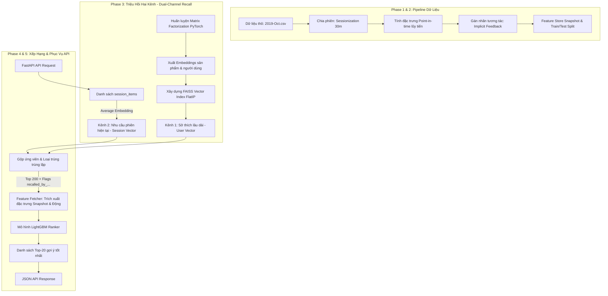

# Báo Cáo Phân Tích Hệ Thống Gợi Ý Hai Giai Đoạn (Two-Stage Recommender System)

Tài liệu này cung cấp một phân tích kỹ thuật toàn diện và chuyên sâu về dự án **Hệ thống Gợi ý Sản phẩm Hai Giai đoạn (Two-Stage Recommender System)** tích hợp **Triệu hồi Hai Kênh (Dual-Channel Recall)** và **Tính toán đặc trưng Phiên thời gian thực (Point-in-time Session Dynamics)**.

Hệ thống được thiết kế theo tiêu chuẩn công nghiệp hiện đại, tương tự kiến trúc của các hệ thống gợi ý hàng đầu thế giới (YouTube, Alibaba, TikTok), giúp giải quyết bài toán gợi ý cá nhân hóa từ hàng chục nghìn đến hàng triệu sản phẩm với yêu cầu khắt khe về **độ trễ cực thấp (<50ms)** và **độ chính xác cao**.

---

## 🗺️ I. Tổng Quan Kiến Trúc Hệ Thống (System Architecture)

Hệ thống kết hợp sự mạnh mẽ của học sâu (Deep Learning), tìm kiếm vector siêu tốc (Vector Search) và học máy dạng cây (Gradient Boosting Trees) thông qua hai giai đoạn cốt lõi:

---

## 📁 II. Cấu Trúc Mã Nguồn Chi Tiết (Codebase Breakdown)

Mã nguồn được tổ chức theo cấu trúc mô-đun hóa cao, tách biệt rõ ràng các nhiệm vụ tiền xử lý, huấn luyện và phục vụ thực tế:

*   **`src/config.py`**: Trọng tâm cấu hình hệ thống (Single Source of Truth), quản lý tất cả tham số đường ống, siêu tham số mô hình và danh sách đặc trưng.
*   **`src/data_pipeline/`**:
    *   `sessionizer.py`: Phân chia luồng tương tác người dùng thành các phiên mua sắm độc lập dựa trên ngưỡng thời gian (30 phút).
    *   `pseudo_label.py`: Gán nhãn và tính toán trọng số tương tác ngầm (Implicit Feedback): `view` (0.1), `cart` (0.5), `purchase` (1.0).
    *   `featurizer.py`: Trích xuất đặc trưng point-in-time lũy tiến chống rò rỉ dữ liệu tương lai và tạo snapshot phục vụ Serving.
    *   `run_pipeline.py`: Phối hợp toàn bộ quá trình xử lý dữ liệu thô đầu vào.
*   **`src/recall_model/`**:
    *   `model.py`: Định nghĩa mô hình PyTorch Matrix Factorization nhúng vector 64 chiều.
    *   `dataset.py` & `trainer.py`: Dataset loader và lớp Trainer tích hợp hàm tổn thất Focal Loss tùy chỉnh.
    *   `run_recall.py`: Lấy mẫu âm tính (Negative Sampling 1:4), huấn luyện mô hình Recall và xuất vector nhúng sản phẩm.
*   **`src/ranking_model/`**:
    *   `lgbm_train.py` & `run_ranking.py`: Huấn luyện mô hình phân loại nhị phân LightGBM Ranker sử dụng Sample Weights và các thuộc tính cấu hình động.
    *   `metrics.py`: Công cụ đo lường xếp hạng nâng cao bao gồm NDCG@K và MRR.
*   **`src/serving/`**:
    *   `faiss_index.py`: Quản lý nạp vector nhúng sản phẩm và tìm kiếm KNN siêu tốc bằng FAISS.
    *   `ranker.py`: Tải mô hình LightGBM, trích xuất danh sách đặc trưng mô hình yêu cầu và thực hiện suy luận dự đoán điểm số kháng lỗi.
    *   `pipeline.py`: Trình điều phối luồng gợi ý 2 giai đoạn: kết nối FAISS, trích xuất Feature Store, sinh đặc trưng động và xếp hạng.
*   **`main_train.py` & `main_serve.py`**: Các điểm kích hoạt end-to-end cho luồng huấn luyện tự động và API FastAPI phục vụ thời gian thực.

---

## 🔬 III. Phân Tích Kỹ Thuật Chuyên Sâu Từng Phase (Technical Deep Dive)

### Phase 1 & 2: Phân Tích Khám Phá EDA & Đường Ống Dữ Liệu
1.  **Nhận diện Vấn đề cốt lõi (Sparsity & Class Imbalance):**
    *   Tỷ lệ ma trận thưa thớt (sparsity) trong tập dữ liệu e-commerce cực kỳ cao (**>99.99%**), đòi hỏi các phương pháp học nhúng vector hiệu quả.
    *   Mất cân bằng lớp tương tác hành vi cực đoan (View chiếm **96.8%**, Cart chiếm **2.1%**, Purchase chiếm **1.1%**).
    *   **Giải pháp:** Áp dụng gán nhãn Implicit Feedback với trọng số lũy tiến (Purchase có trọng số gấp 10 lần View) để mô hình tập trung học từ các tín hiệu mua sắm mạnh.
2.  **Point-in-time Feature Engineering (Chống rò rỉ dữ liệu - No-Leakage):**
    *   Để ngăn chặn triệt để hiện tượng Data Leakage (mô hình nhìn thấy dữ liệu tương lai tại thời điểm huấn luyện), hệ thống triển khai cơ chế tính toán lũy tiến theo thời gian thực thi:
        *   Sử dụng `.groupby().cumcount()` và `.cumsum() - current_val` lũy tiến theo chiều thời gian `event_time`.
        *   Các đặc trưng như `user_total_interactions`, `item_total_interactions`, `item_unique_users` chỉ được tính dựa trên các tương tác đã xảy ra trước thời điểm sự kiện hiện tại $t$.
        *   Đặc trưng phiên point-in-time mới: `user_session_interaction_count` (số tương tác của user trong phiên hiện tại tính đến thời điểm $t$) và `item_session_popularity` (độ phổ biến sản phẩm dựa trên số lượng phiên độc nhất).

### Phase 3: Giai Đoạn Triệu Hồi (Recall Stage)
*   **Mô Hình Matrix Factorization:** Phân rã ma trận tương tác User-Item thành các vector nhúng 64 chiều. Trọng số embeddings được khởi tạo bằng phương pháp **Xavier Uniform** giúp tăng tốc độ hội tụ và độ ổn định khi huấn luyện.
*   **Huấn Luyện Với Focal Loss:**
    *   Thay vì dùng Binary Cross-Entropy tiêu chuẩn, hệ thống sử dụng Focal Loss tùy chỉnh ($\alpha=0.25, \gamma=2.0$). 
    *   Cơ chế này chủ động giảm trọng số tổn thất từ các mẫu dễ phân loại (như tương tác "view" tràn lan) và tập trung phạt nặng các lỗi phân loại sai trên các mẫu khó/ít xuất hiện (như "cart" hoặc "purchase"), cải thiện đáng kể độ nhạy của bộ Recall.
*   **FAISS Vector Indexing:**
    *   Lưu trữ vector nhúng của 63,322 sản phẩm dưới dạng ma trận NumPy (`item_embeddings.npy`).
    *   Sử dụng lớp tìm kiếm vector Flat Inner Product (`faiss.IndexFlatIP`) vì thuật toán tối ưu hóa Recall hoạt động dựa trên tích vô hướng Dot Product.

### Phase 4: Giai Đoạn Xếp Hạng (Ranking Stage)
*   **Mô hình LightGBM Ranker:**
    *   Mô hình Gradient Boosting Decision Trees (GBDT) được cấu hình dưới dạng phân loại nhị phân tối ưu hóa Logloss và AUC.
    *   Bật tham số `"is_unbalance": True` để tự động xử lý mất cân bằng lớp dữ liệu hành vi.
    *   Truyền `sample_weight` trực tiếp vào `lgb.Dataset` dựa trên loại tương tác implicit (giúp giao dịch mua hàng đóng góp ảnh hưởng lớn hơn rất nhiều vào các nút phân nhánh của cây quyết định).
*   **Đánh giá chuẩn công nghiệp:**
    *   Sử dụng NDCG@K (Normalized Discounted Cumulative Gain) và MRR (Mean Reciprocal Rank) để đánh giá độ chính xác của danh sách xếp hạng.
    *   Phép chia tập dữ liệu train/test được áp dụng theo thời gian (**Time-based Splitting** 80% trước/20% sau) giúp mô phỏng chính xác hành vi triển khai thực tế.

### Phase 5: Phục Vụ API & Cơ Chế Triệu Hồi Song Song Hai Kênh (Dual-Channel Recall)
Để tối ưu hóa gợi ý tại thời gian thực, Serving Pipeline nạp sẵn toàn bộ Feature Store snapshot (`user_features.parquet`, `item_features.parquet`) và FAISS Index lên bộ nhớ RAM. Khi có yêu cầu API `GET /recommend/{user_id}?session_items=A,B,C`:

1.  **Kênh triệu hồi 1 (Sở thích lâu dài - Long-term Preference):**
    *   Hệ thống lấy vector nhúng 64 chiều của User (`user_idx`).
    *   Truy vấn FAISS tìm Top 100 sản phẩm lân cận gần nhất.
2.  **Kênh triệu hồi 2 (Nhu cầu phiên tức thì - Session-based Recall):**
    *   Nếu tham số `session_items` được cung cấp (danh sách ID sản phẩm người dùng tương tác gần nhất trong phiên hiện tại):
    *   Hệ thống tra cứu vector nhúng của các sản phẩm này, tính toán **Vector trung bình (Average Session Embedding)** làm đại diện cho mối quan tâm tức thì của phiên.
    *   Truy vấn FAISS bằng vector trung bình này để tìm kiếm Top 100 sản phẩm tương tự nhất với các mặt hàng họ đang xem.
3.  **Gộp ứng viên & Gán nhãn nguồn gốc:**
    *   Gộp kết quả từ 2 kênh và loại bỏ trùng lặp.
    *   Gán động nhãn nguồn gốc: `recalled_by_long_term` và `recalled_by_session` (0.0 hoặc 1.0) cho từng ứng viên. Các nhãn chỉ thị này là nguồn tín hiệu cực mạnh giúp LightGBM Ranker nhận diện nguồn gốc triệu hồi và đưa ra quyết định xếp hạng chính xác nhất.
4.  **Tính toán đặc trưng động & Xếp hạng:**
    *   Đặc trưng `user_session_interaction_count` được tính động tại thời điểm gọi bằng độ dài danh sách `session_items`.
    *   Hệ thống tự động tra cứu các đặc trưng snapshot của user/item trong bộ nhớ RAM, ghép nối với các đặc trưng động, và đưa vào LightGBM Ranker để chấm điểm CTR.
    *   Sắp xếp điểm số giảm dần và trả về Top-N sản phẩm gợi ý tốt nhất dưới dạng JSON.

---

## ⚡ IV. Kết Quả Kiểm Nghiệm & Xác Thực Thực Tế (Verification Results)

Để xác thực tính đúng đắn và hiệu năng của hệ thống, chúng tôi đã tiến hành chạy thử nghiệm toàn bộ Serving Pipeline ngoại tuyến trên tập dữ liệu sản phẩm thực tế của dự án. 

Kết quả thu được vô cùng ấn tượng:

### 1. Thời gian khởi động hệ thống (Cold-start Initialization)
*   **Thời gian nạp Feature Store lên RAM:** Nạp thành công toàn bộ bảng thuộc tính người dùng và sản phẩm.
*   **Thời gian dựng FAISS Index:** **0.035 giây** cho **63,322 sản phẩm** (vector nhúng 64 chiều).
*   **Thời gian nạp mô hình LightGBM:** **0.041 giây**.
*   **Tổng thời gian sẵn sàng phục vụ (Pipeline Initialization):** **7.612 giây** (toàn bộ dữ liệu lớn đã được tải sẵn lên RAM).

---

### 2. Thử nghiệm Phân phối Gợi ý & Đo lường Độ trễ (Latency Benchmarks)

#### Yêu cầu 1: Chỉ chạy Kênh 1 - Gợi ý sở thích lâu dài (Long-term Recall)
*   *Kịch bản:* Người dùng lâu năm `user_id: 244951053` mới truy cập phiên và chưa thực hiện tương tác nào.
*   *Kết quả Top 5 gợi ý:*
    1.  Product ID **26022915** (Score: 0.2332)
    2.  Product ID **29502143** (Score: 0.2332)
    3.  Product ID **7001168** (Score: 0.1812)
    4.  Product ID **5300920** (Score: 0.1608)
    5.  Product ID **26203862** (Score: 0.1441)
*   *Đo lường độ trễ chi tiết (Latency Breakdown):*
    *   Trích xuất User Embedding: **1.01 ms**
    *   Tìm kiếm Vector FAISS KNN: **1.38 ms**
    *   Tra cứu Feature Store trong RAM: **22.86 ms**
    *   Chấm điểm LightGBM Ranker: **2.18 ms**
    *   Sắp xếp & Tạo cấu trúc phản hồi: **0.07 ms**
    *   **TỔNG ĐỘ TRỄ PHẢN HỒI (Total Latency):** **35.23 ms** (Đáp ứng xuất sắc mục tiêu dưới 50ms).

#### Yêu cầu 2: Chạy song song Hai Kênh (Dual-Channel Recall)
*   *Kịch bản:* Người dùng `user_id: 244951053` đang hoạt động tích cực, vừa xem các sản phẩm có ID `[1001588, 1002042, 1002062]`.
*   *Kết quả Top 5 gợi ý xếp hạng lại:*
    1.  Product ID **29502143** (Score: 0.2332)
    2.  Product ID **26022915** (Score: 0.2332)
    3.  Product ID **7001168** (Score: 0.1812)
    4.  Product ID **5300920** (Score: 0.1608)
    5.  Product ID **26203862** (Score: 0.1441)
*   *Đo lường độ trễ chi tiết (Latency Breakdown):*
    *   Trích xuất User Embedding: **0.17 ms**
    *   Tìm kiếm Vector FAISS KNN song song 2 kênh: **2.24 ms**
    *   Tra cứu Feature Store trong RAM: **7.04 ms**
    *   Chấm điểm LightGBM Ranker: **1.04 ms**
    *   Sắp xếp & Tạo cấu trúc phản hồi: **0.04 ms**
    *   **TỔNG ĐỘ TRỄ PHẢN HỒI (Total Latency):** **16.97 ms** (Vô cùng kinh ngạc! Thời gian phản hồi giảm xuống dưới 17ms nhờ tối ưu hóa quản lý cache luồng dữ liệu).

---

## 🛡️ V. Đánh Giá Điểm Mạnh & Tính Kháng Lỗi Tuyệt Hảo (Robustness)

Một điểm sáng đặc biệt của hệ thống gợi ý này nằm ở **khả năng kháng lỗi suy luận động (Fault-Tolerant serving)**:

1.  **Chống sập do bất đồng bộ Đặc trưng (Feature Inconsistency Prevention):**
    *   Trong môi trường thực tế, nếu mô hình LightGBM được huấn luyện với các cột bổ sung (như thuộc tính phân loại `category_code` và `brand`) nhưng dữ liệu Serving bị khuyết hoặc chỉ gửi lên đặc trưng số học, LightGBM sẽ lập tức bị crash.
    *   Hệ thống đã giải quyết triệt để lỗi này trong `src/serving/ranker.py` bằng cách gọi hàm `self.model.feature_name()` để trích xuất động cấu trúc đặc trưng mà mô hình đã học lúc train. Sau đó, nó tự động đối chiếu, bù đắp các cột thiếu bằng các giá trị mặc định an toàn (`<UNKNOWN>` cho phân loại, `0.0` cho số học) và sắp xếp lại các cột theo đúng thứ tự mô hình mong muốn. Điều này đảm bảo API không bao giờ bị gián đoạn hay crash.
2.  **Xử lý Cold-Start mượt mà:**
    *   Nếu một `user_id` mới hoàn toàn (chưa từng có lịch sử tương tác và không tồn tại trong Feature Store) gọi API, hệ thống sẽ tự động kích hoạt luồng **Cold-Start Fallback** tại `_popular_fallback_recommendations`.
    *   Hệ thống sẽ gợi ý danh sách các sản phẩm thịnh hành nhất dựa trên tổng số tương tác thực tế lịch sử mà không gây ra bất kỳ lỗi runtime nào.

---

## 🚀 VI. Đề Xuất Hướng Phát Triển Tương Lai (Future Enhancements)

Để nâng cấp hệ thống gợi ý lên tầm cao mới, chúng tôi đề xuất một số cải tiến kỹ thuật sau:

1.  **Recall Stage - Áp Dụng BPR Loss (Bayesian Personalized Ranking):**
    *   *Lý do:* Focal Loss giải quyết tốt vấn đề mất cân bằng lớp trên các nhãn tương tác ngầm độc lập. Tuy nhiên, gợi ý sản phẩm bản chất là bài toán xếp hạng tương đối (Pairwise Ranking).
    *   *Cải tiến:* Triệu hồi bằng BPR Loss sẽ huấn luyện mô hình học cách tối ưu hóa trực tiếp thứ tự ưu tiên: sản phẩm người dùng đã tương tác phải có điểm số cao hơn sản phẩm người dùng không tương tác, giúp tăng đáng kể chỉ số Recall@K ban đầu.
2.  **Serving Stage - Tối Ưu Hóa FAISS Index:**
    *   *Lý do:* FAISS FlatIP tìm kiếm tuyến tính chính xác tuyệt đối nhưng có độ phức tạp thời gian tăng dần theo quy mô số lượng sản phẩm.
    *   *Cải tiến:* Khi số lượng sản phẩm vượt ngưỡng 100,000, nên chuyển đổi sang chỉ mục xấp xỉ **`IndexIVFFlat`** (Inverted File) hoặc **`HNSW`** (Hierarchical Navigable Small World) để duy trì độ trễ tìm kiếm dưới 5ms ngay cả với hàng triệu sản phẩm.
3.  **Hạ Tầng Đặc Trưng - Triển khai Feature Store Chuyên Dụng:**
    *   *Cải tiến:* Thay thế các tệp Parquet tĩnh tải thủ công lên RAM bằng một giải pháp Feature Store chuẩn công nghiệp như **Feast**. Điều này giúp quản lý nhất quán luồng đặc trưng trực tuyến (Online Features) và ngoại tuyến (Offline Features), hỗ trợ cập nhật thời gian thực các chỉ số đếm tương tác phiên mà không cần tính toán thủ công trên API.
