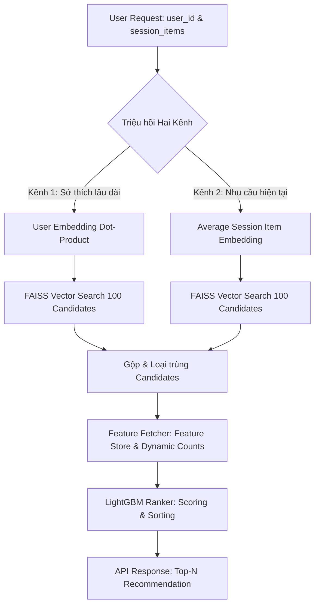

# Hướng dẫn Vận hành & Walkthrough: Cải tiến Hệ thống Đặc trưng Phiên & Recall Hai Kênh

Tài liệu này tổng hợp toàn bộ các thay đổi kiến trúc và tính năng đã được triển khai thành công nhằm nâng cấp hệ thống gợi ý lên **Hệ thống gợi ý Hai giai đoạn chuẩn Công nghiệp (Industrial Recommender)**.

---

## 1. Tóm tắt các Thay đổi đã Triển khai (Implemented Architecture)

Chúng tôi đã hoàn thành toàn bộ 5 bước của kế hoạch triển khai nâng cấp đặc trưng phiên và triệu hồi 2 kênh:



### 1.1. Cấu hình Đặc trưng Tập trung tại [config.py](file:///D:/programing/project/EDA_project/src/config.py)
*   Thêm đặc trưng phiên: `user_session_interaction_count` và `item_session_popularity`.
*   Thêm đặc trưng chỉ thị kênh triệu hồi: `recalled_by_long_term` và `recalled_by_session`.
*   Quy định kích thước triệu hồi cho từng kênh: `RECALL_TOP_K_LONG_TERM = 100` và `RECALL_TOP_K_SESSION = 100`.

### 1.2. Tính toán Đặc trưng Phiên Point-in-time tại [featurizer.py](file:///D:/programing/project/EDA_project/src/data_pipeline/featurizer.py)
*   **Hàm `add_point_in_time_features`:** Tính toán động lũy tiến theo thời gian `event_time` để loại bỏ triệt để rò rỉ dữ liệu tương lai (No-Lookahead Leakage):
    *   `user_session_interaction_count`: Đếm lũy tiến số tương tác của user trong phiên hiện tại bằng `.groupby(...).cumcount()`.
    *   `item_session_popularity`: Đếm lũy tiến số lượng phiên chứa sản phẩm này bằng `.cumsum()`.
    *   Nhãn chỉ thị kênh (`recalled_by_long_term`, `recalled_by_session`) được mặc định bằng `1.0` cho tập dữ liệu tương tác thực tế lịch sử.
*   **Hàm `extract_item_features`:** Tích hợp tính tổng số lượng phiên lịch sử chứa sản phẩm để lưu trữ trong Serving Feature Store (`item_features.parquet`).

### 1.3. Triệu hồi Hai Kênh và Chỉ thị Kênh gợi ý tại [pipeline.py](file:///D:/programing/project/EDA_project/src/serving/pipeline.py)
*   Nâng cấp hàm `recommend()` và `recommend_by_index()` nhận thêm danh sách `session_items` (các ID sản phẩm tương tác gần nhất trong phiên).
*   **Triển khai Kênh 1 (Sở thích lâu dài):** Tìm kiếm vector bằng User Embedding của người dùng.
*   **Triển khai Kênh 2 (Nhu cầu phiên hiện tại):** 
    *   Tìm và lấy Embeddings của các sản phẩm nằm trong `session_items`.
    *   Tính vector trung bình đại diện cho phiên (**Average Item Embedding**).
    *   Truy vấn FAISS để tìm 100 sản phẩm tương tự nhất với mối quan tâm tức thì của phiên.
*   **Gộp & Loại trùng:** Gộp kết quả của cả 2 kênh và tạo cột chỉ thị `recalled_by_long_term` và `recalled_by_session` tương ứng.
*   **Tính toán động:** Gán `user_session_interaction_count` tại thời điểm chạy API bằng đúng độ dài của danh sách `session_items`.

### 1.4. Trình Xếp hạng Động và Kháng lỗi tại [ranker.py](file:///D:/programing/project/EDA_project/src/serving/ranker.py)
*   `LightGBMRanker` tự động đọc danh sách và thứ tự đặc trưng từ tệp mô hình đã huấn luyện (`self.model.feature_name()`).
*   Tự động bù đắp các đặc trưng bị khuyết (như `recalled_by_session` hoặc các đặc trưng phiên khi không có lịch sử) bằng các giá trị mặc định (`0.0` hoặc `<UNKNOWN>`), đảm bảo hệ thống không bao giờ bị crash.

### 1.5. Huấn luyện Đặc trưng Động tại [run_ranking.py](file:///D:/programing/project/EDA_project/src/ranking_model/run_ranking.py)
*   Thay thế danh sách đặc trưng hardcode bằng cách tự động nạp toàn bộ đặc trưng số và đặc trưng phân loại từ `config.py`, đảm bảo mô hình LightGBM luôn học đúng và đủ các đặc trưng mới được cấu hình.

---

## 2. API Endpoint & Hướng dẫn Vận hành (API Usage Guide)

API FastAPI tại [main_serve.py](file:///D:/programing/project/EDA_project/main_serve.py) đã hỗ trợ đầy đủ việc truyền tham số phiên qua Query Parameter dưới dạng chuỗi phân tách bằng dấu phẩy.

### 2.1. Khởi động API Server
```bash
uv run python main_serve.py
```

### 2.2. Gợi ý theo Kênh 1 (User lâu năm, không có lịch sử phiên hiện tại)
Nếu người dùng chưa thực hiện hành động nào trong phiên này, hệ thống sẽ sử dụng sở thích lâu dài của họ để gợi ý:
*   **Request URL:** `GET /recommend/10005`
*   **Hành vi:** Chỉ chạy Kênh 1. Cột `recalled_by_session` của các ứng viên sẽ bằng `0.0`.

### 2.3. Gợi ý theo Hai Kênh (User đang hoạt động tích cực trong phiên)
Nếu người dùng vừa xem hoặc thêm vào giỏ sản phẩm có ID `5700030` và `5700140` trong phiên này:
*   **Request URL:** `GET /recommend/10005?session_items=5700030,5700140`
*   **Hành vi:** 
    *   Hệ thống tính toán vector trung bình của sản phẩm `5700030` và `5700140`.
    *   Triệu hồi các ứng viên tương tự từ FAISS (Kênh 2) kết hợp với ứng viên Kênh 1.
    *   Gộp ứng viên, gán nhãn chỉ thị kênh và xếp hạng lại bằng LightGBM.
    *   Đặc trưng `user_session_interaction_count` tự động tính bằng `2.0`.
