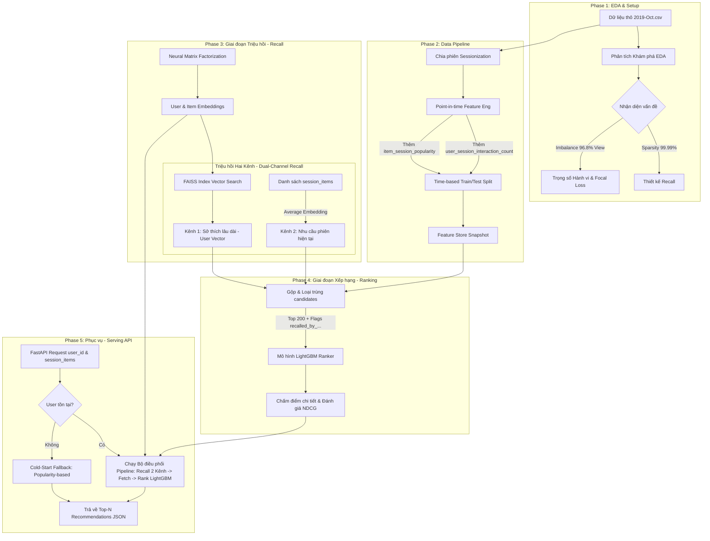

# Tổng Quan Kiến Trúc Hệ Thống Gợi Ý Hai Giai Đoạn (Two-Stage Recommender System)

Chào mừng bạn đến với tài liệu hướng dẫn kỹ thuật chi tiết của hệ thống gợi ý thương mại điện tử. Thư mục này (`explain/`) chứa các bài giải thích chi tiết, trực quan và bám sát kỹ thuật cho từng Phase phát triển của dự án.

Hệ thống của chúng ta được xây dựng theo kiến trúc **Hai Giai Đoạn (Two-Stage)** kết hợp **Triệu hồi Hai Kênh (Dual-Channel Recall)** tiêu chuẩn công nghiệp. Kiến trúc này được sử dụng rộng rãi bởi các tập đoàn lớn như YouTube, Alibaba và TikTok để giải quyết bài toán gợi ý sản phẩm cá nhân hóa từ hàng triệu mặt hàng với độ trễ dưới 100ms.

---

## 🗺️ Lộ Trình Phát Triển & Sơ Đồ Luồng (Architectural Workflow)

Kiến trúc hệ thống được chia làm 5 giai đoạn chính nối tiếp nhau, tạo thành một chu trình khép kín từ dữ liệu thô đến API phục vụ thời gian thực tích hợp bối cảnh phiên (session dynamics):

---

## 📁 Cấu Trúc Các Bài Giải Thích Chi Tiết

Để hiểu sâu sắc về thiết kế hệ thống, thuật toán, công nghệ và các ví dụ thực tế tương ứng với từng giai đoạn, bạn hãy đọc lần lượt các tệp hướng dẫn dưới đây:

| Tệp Tài Liệu | Giai Đoạn | Trọng Tâm Kỹ Thuật | Từ Khóa Công Nghệ |
| :--- | :--- | :--- | :--- |
| 📘 **[Phase 1: EDA & Setup](file:///D:/programing/project/EDA_project/explain/phase_1_eda_and_setup.md)** | Phân Tích & Thiết Lập | Khám phá phân phối hành vi, độ thưa thớt ma trận và độ lệch giá sản phẩm | `uv`, `pandas`, `sparsity`, `class imbalance` |
| 📗 **[Phase 2: Data Pipeline](file:///D:/programing/project/EDA_project/explain/phase_2_data_pipeline.md)** | Đường Ống Dữ Liệu | Ngăn chặn rò rỉ thời gian (Data Leakage), chia phiên hành vi, đặc trưng lũy kế cấp phiên | `Point-in-time`, `Sessionization`, `Log-Transform`, `Parquet` |
| 📙 **[Phase 3: Recall Model](file:///D:/programing/project/EDA_project/explain/phase_3_recall_model.md)** | Bộ Lọc Triệu Hồi | Học nhúng vector, kết nối 2 kênh triệu hồi (Sở thích lâu dài + Nhu cầu phiên) qua FAISS | `PyTorch`, `Average Item Embedding`, `Focal Loss`, `Dual-Channel Recall` |
| 📕 **[Phase 4: Ranking Model](file:///D:/programing/project/EDA_project/explain/phase_4_ranking_model.md)** | Bộ Xếp Hạng Chi Tiết | Cây quyết định xếp hạng, đồng bộ đặc trưng động từ config, tối ưu hóa hiển thị | `LightGBM`, `Sample Weights`, `NDCG@K`, `Dynamic Features` |
| 🪟 **[Phase 5: Serving Pipeline](file:///D:/programing/project/EDA_project/explain/phase_5_serving_pipeline.md)** | Phục Vụ Thời Gian Thực | Điều phối API bất đồng bộ, gộp kênh triệu hồi, tra cứu RAM Feature Store kháng lỗi | `FastAPI`, `FAISS Index`, `Session History Parsing`, `Cold-Start` |

---

> [!NOTE]
> **Sự kết hợp hoàn hảo giữa Triệu hồi Hai Kênh và Xếp hạng:**
> -   **Recall** giống như một tấm lưới đánh cá mắt to giúp gom nhanh hàng trăm sản phẩm phù hợp nhất từ 2 kênh: Sở thích lâu dài của người dùng (Kênh 1) và Nhu cầu nóng hổi tại phiên mua sắm hiện tại (Kênh 2).
> -   **Ranking** giống như một chuyên gia kiểm định tỉ mỉ từng con cá trong lưới, xem xét các biến số thời gian thực và đặc trưng chỉ thị kênh triệu hồi (`recalled_by_...`) để xếp những con cá ngon nhất lên trên cùng. 
> Sự kết hợp này mang lại sự cân bằng hoàn hảo giữa **Tốc độ (Latency)** và **Độ chính xác (Accuracy)**.
