# Phase 4: Giai Đoạn Xếp Hạng Chi Tiết (Ranking Model) & Thuật Toán LightGBM

Sau khi chiếc phễu triệu hồi ở Phase 3 lọc thô danh mục sản phẩm từ hàng triệu xuống còn 200 ứng viên tiềm năng nhất bằng cơ chế hai kênh, chúng ta cần một "chuyên gia tư vấn chuyên nghiệp" để so sánh cực kỳ tỉ mỉ, cân đo đong đếm các thuộc tính thời gian thực của người dùng và sản phẩm. Giai đoạn Xếp hạng (Ranking) đảm nhận nhiệm vụ này: chấm điểm chi tiết từng ứng viên và sắp xếp chúng theo thứ tự tối ưu nhất nhằm tối đa hóa khả năng tương tác/chuyển đổi của khách hàng.

---

## 🎯 Mục Tiêu Của Phase 4

1.  **Chấm điểm chính xác**: Kết hợp hàng chục đặc trưng phi tuyến tính phức tạp (giá cả, mức độ thịnh hành của sản phẩm, hành vi phiên của người dùng, nguồn gốc triệu hồi) để tính điểm tương hợp chi tiết cho từng cặp User-Item.
2.  **Huấn luyện thuật toán Gradient Boosting (LightGBM)**: Sử dụng mô hình cây quyết định cực kỳ mạnh mẽ để học các mối quan hệ phi tuyến tính phức tạp từ dữ liệu dạng bảng.
3.  **Đồng bộ đặc trưng động (Dynamic Feature Loading)**: Thống nhất danh sách đặc trưng tại cấu hình hệ thống `config.py` làm nguồn chuẩn duy nhất, tự động nạp vào luồng huấn luyện giúp hệ thống mở rộng linh hoạt.
4.  **Tích hợp trọng số tương tác (Sample Weights)**: Dạy mô hình hiểu rằng hành vi mua hàng (Purchase) có giá trị cao gấp 10 lần hành vi xem hàng (View) bằng cách truyền trọng số mẫu trực tiếp vào quá trình tối ưu hóa.
5.  **Đánh giá chất lượng xếp hạng**: Sử dụng các độ đo xếp hạng chuẩn mực công nghiệp như **NDCG@K** và **MRR@K** để đảm bảo sản phẩm tốt nhất luôn nằm ở vị trí đầu tiên.

---

## 📁 Thư Mục Khởi Tạo & Vai Trò

Trong Phase này, mô hình xếp hạng dạng bảng được xây dựng và huấn luyện bằng LightGBM trong thư mục `src/ranking_model/` cùng với notebook thử nghiệm:

```
EDA_project/
├── models_store/
│   └── ranker_model.txt          # File văn bản tuần tự hóa cây quyết định LightGBM đã huấn luyện
├── notebooks/
│   └── 04_Ranking_Exp.ipynb      # Vở bài tập chạy thử nghiệm và viết nháp mô hình LightGBM
└── src/
    └── ranking_model/
        ├── __init__.py
        ├── lgbm_train.py         # Cấu hình tham số và thiết lập cấu trúc LightGBM Dataset
        ├── metrics.py            # Hàm tính toán chỉ số đánh giá xếp hạng chuyên sâu (NDCG, MRR)
        ├── run_ranking.py        # Kịch bản huấn luyện baseline (chỉ dùng dữ liệu tương tác tĩnh)
        └── train_on_recall.py    # [CẢI TIẾN] Kịch bản sinh ứng viên recall thực tế và huấn luyện xếp hạng tối ưu
```

### 🔹 Mục đích chi tiết của từng tệp:

*   **`notebooks/04_Ranking_Exp.ipynb`**:
    *   *Kỹ thuật*: Tệp Jupyter Notebook dùng để Prototyping cho khâu Ranking. Nạp và ghép nối dữ liệu phẳng với các đặc trưng snapshot của User/Item lấy từ Feature Store, huấn luyện thử nghiệm thuật toán LightGBM dạng phân loại nhị phân, truyền `sample_weight` cho các hành vi implicit và tính toán nhanh các chỉ số NDCG và MRR trước khi đóng gói code sạch vào `src/ranking_model/`.

*   **`lgbm_train.py`**:
    *   *Kỹ thuật*: Chứa logic cấu hình thuật toán LightGBM. Thiết lập cấu trúc `lgb.Dataset(X, y, weight=sample_weights)` tích hợp Sample Weights. Đồng thời, tệp cấu hình tham số chống mất cân bằng cực đoan như `is_unbalance=True` hoặc tự động điều chỉnh `scale_pos_weight` giúp mô hình không bị lệch hướng bởi số lượng View khổng lồ.
*   **`metrics.py`**:
    *   *Kỹ thuật*: Triển khai các hàm toán học chuyên sâu để đánh giá thứ tự hiển thị:
        *   `ndcg_at_k`: Đo lường mức độ hữu ích của sản phẩm dựa trên vị trí của nó trong danh sách khuyến nghị. Một sản phẩm được mua nếu xếp thứ 1 sẽ đem lại điểm NDCG cao hơn nhiều so với việc nó bị xếp ở thứ 10.
        *   `mrr`: Tính nghịch đảo vị trí của sản phẩm có tương tác đầu tiên. Giúp đánh giá xem người dùng có phải cuộn màn hình xuống quá sâu để thấy món đồ họ thích hay không.
*   **`run_ranking.py`**:
    *   *Kỹ thuật*: Script huấn luyện baseline tĩnh. Nó chỉ dùng các sản phẩm người dùng đã click tương tác lịch sử, dẫn đến lỗi Train-Test Distribution Mismatch nghiêm trọng (Validation AUC chỉ đạt `0.6375`, NDCG@10 = `0.0495`, MRR = `0.0458`).
*   **`train_on_recall.py` [CẢI TIẾN VƯỢT TRỘI]**:
    *   *Kỹ thuật*: Script sinh dữ liệu huấn luyện xếp hạng thực tế dựa trên **mẫu âm triệu hồi từ Recall Candidates**. 
    *   *Cơ chế:* Duyệt qua từng phiên tương tác, gọi bộ Recall PyTorch + FAISS tìm 200 ứng viên, gán nhãn `1` cho các ứng viên thực tế người dùng tương tác, và nhãn `0` (với sample weight 0.1) cho các ứng viên không tương tác (True Negatives). Ghép nối vectorized merge đặc trưng User/Item, và huấn luyện lại LightGBM.
    *   *Hiệu năng:* Validation AUC tăng vọt lên **0.9601** (+50.6%), NDCG@10 đạt **0.0653** (+31.9%), MRR đạt **0.0572** (+24.9%).

---

## 🛠️ Đồng Bộ Hóa Đặc Trưng & Cơ Chế Huấn Luyện Động (Dynamic Features)

Để loại bỏ hoàn toàn sự không nhất quán giữa hai khâu Huấn luyện và Suy luận thời gian thực (Serving), toàn bộ cấu hình đặc trưng được quy hoạch tập trung tại `src/config.py`:
*   `config.NUMERICAL_FEATURES`: Chứa toàn bộ đặc trưng số học tĩnh, đặc trưng phiên point-in-time (`user_session_interaction_count`, `item_session_popularity`) và các chỉ thị kênh recall (`recalled_by_long_term`, `recalled_by_session`).
*   `config.CATEGORICAL_FEATURES`: Chứa các đặc trưng phân loại (`category_code`, `brand`).

Tại `train_on_recall.py` và `run_ranking.py`, danh sách đặc trưng đầu vào được tự động nạp động:
```python
    features = []
    for col in config.NUMERICAL_FEATURES:
        if col in df.columns:
            features.append(col)
    for col in config.CATEGORICAL_FEATURES:
        if col in df.columns:
            features.append(col)
```

### Tại sao cải tiến này cực kỳ quan trọng?
1.  **Nhất quán tuyệt đối (Zero Feature Mismatch):** Khi huấn luyện thêm đặc trưng mới (ví dụ: các đặc trưng phiên), mô hình LightGBM sẽ tự động học các cột này. Tại khâu Serving, bộ suy luận `LightGBMRanker` sẽ tự động đọc danh sách cột từ file mô hình đã lưu và trích xuất đúng các cột đó để dự đoán, loại bỏ hoàn toàn lỗi crash do lệch số lượng đặc trưng đầu vào.
2.  **Học tín hiệu triệu hồi thực tế:** Ở mô hình `train_on_recall.py` cải tiến, LightGBM được huấn luyện trực tiếp với hai cột chỉ thị `recalled_by_long_term` và `recalled_by_session` được gán chính xác cờ nhị phân (0.0 hoặc 1.0) từ FAISS search của bộ triệu hồi. Khi suy luận, các cờ chỉ thị này đóng vai trò là nguồn tín hiệu cực kỳ mạnh mẽ để cây quyết định phân biệt và chấm điểm chính xác bối cảnh phiên.

---

## 🌳 [CẢI TIẾN] Đường Ống Huấn Luyện Trên Ứng Viên Recall (Train-on-Recall)

Giải pháp **Train-on-Recall** được thiết lập để giải quyết triệt để lỗi Train-Test Distribution Mismatch nghiêm trọng trong mô hình xếp hạng.

```mermaid
graph TD
    subgraph "Quy trình sinh dữ liệu và huấn luyện cải tiến (train_on_recall.py)"
        A[labeled_sessions.parquet] --> B[Nhóm theo user_id & custom_session_id]
        B --> C[Chọn mẫu 20,000 phiên ngẫu nhiên - Tránh memory explosion]
        C --> D[Chạy bộ Recall PyTorch + FAISS Index]
        D -->|Top 200 Ứng Viên| E[Gộp ứng viên & Gán cờ recalled_by_...]
        E --> F[Gán nhãn thực tế & sample_weight]
        F -->|Trùng với lịch sử| G[Label 1 hoặc 0 theo tương tác thực tế]
        F -->|Không trùng lịch sử| H[Label 0 & Sample Weight 0.1 - Mẫu âm thực sự]
        G --> I[Gom bản ghi thô]
        H --> I
        I --> J[Vectorized Merge với static User/Item Feature Stores]
        J --> K[Time-based Train/Test Split 80/20]
        K --> L[Huấn luyện LightGBM Ranker]
    end
```



### Phân tích so sánh hiệu năng xếp hạng trên tập test độc lập:

| Chỉ số Đánh giá | Mô hình Baseline (run_ranking.py) | Mô hình Train-on-Recall (train_on_recall.py) | Mức độ cải thiện |
| :--- | :---: | :---: | :---: |
| **Validation AUC** | `0.6375` | **0.9601** | **+50.6%** |
| **NDCG@10** | `0.0495` | **0.0653** | **+31.9%** |
| **MRR** | `0.0458` | **0.0572** | **+24.9%** |

---

## 🛠️ Công Nghệ & Khái Niệm Kỹ Thuật Sử Dụng

1.  **LightGBM (Light Gradient Boosting Machine)**:
    *   Khung thuật toán boosting dựa trên cây quyết định được phát triển bởi Microsoft. Nó sử dụng kỹ thuật phát triển cây theo chiều dọc (Leaf-wise), giúp đạt độ chính xác cực cao và tốc độ huấn luyện nhanh gấp nhiều lần so với XGBoost hay CatBoost trên tập dữ liệu lớn.
2.  **Sample Weights (Trọng số mẫu hành vi)**:
    *   Gán trọng số mẫu $w_i \in \{0.1, 0.5, 1.0\}$. Khi tính toán hàm tổn thất Gradient Descent, lỗi dự đoán của mẫu Purchase sẽ bị nhân lên 10 lần so với mẫu View, ép buộc cây quyết định phải tìm các phân ngưỡng đặc trưng giúp dự đoán chính xác hành vi mua hàng thực sự.
3.  **NDCG@K (Normalized Discounted Cumulative Gain)**:
    *   Độ đo xếp hạng chuẩn mực nhất. Điểm số tích lũy của các sản phẩm được giảm dần (discounted) theo logarit của vị trí hiển thị. NDCG@K phạt cực nặng nếu hệ thống xếp các sản phẩm không liên quan lên đầu trang.

