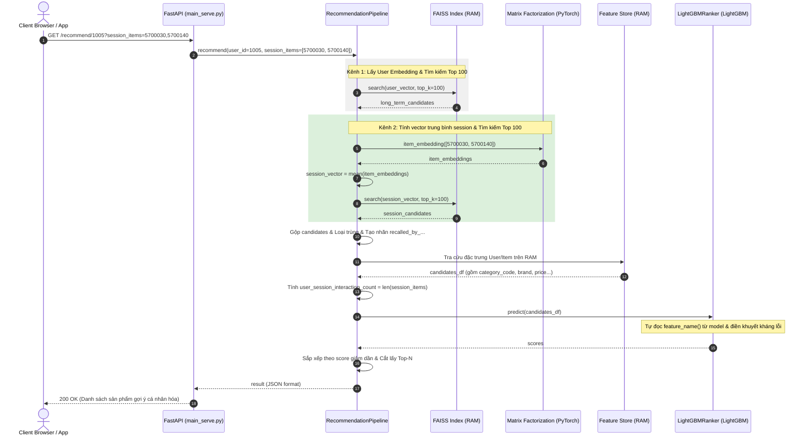

# Phase 5: Hệ Thống Phục Vụ Thời Gian Thực (Serving Pipeline) & Triệu Hồi Hai Kênh (Dual-Channel Recall)

Phase 5 là mảnh ghép cuối cùng và cũng là bộ mặt của toàn bộ hệ thống gợi ý. Tất cả các kết quả huấn luyện từ Phase 3 (Embeddings) và Phase 4 (LightGBM Ranker) cùng với cơ sở dữ liệu đặc trưng từ Phase 2 sẽ được tích hợp lại thành một chu trình khép kín (End-to-End Inference Pipeline) hoạt động cực nhanh dưới dạng API Web RESTful, sẵn sàng tiếp nhận hàng triệu lượt truy cập đồng thời với bối cảnh phiên thời gian thực.

---

## 🎯 Mục Tiêu Của Phase 5

1.  **Đóng gói quy trình suy luận Hai Kênh End-to-End**: Kết nối tuần tự hai kênh triệu hồi (Sở thích lâu dài + Nhu cầu phiên hiện tại) và giai đoạn xếp hạng (Ranking) bằng LightGBM.
2.  **Hỗ trợ truyền lịch sử phiên thời gian thực**: Thiết kế API tiếp nhận các tương tác gần nhất trong phiên của người dùng để cập nhật gợi ý tức thời.
3.  **Kháng lỗi và Đảm bảo Tốc độ phản hồi cực thấp (Low Latency)**: Đảm bảo toàn bộ quy trình diễn ra dưới 100ms bằng cách nạp toàn bộ tài nguyên nặng lên RAM lúc khởi động, đồng thời tự động bù đắp/điền khuyết đặc trưng để tránh lỗi crash API.
4.  **Giải quyết bài toán Khởi đầu lạnh (Cold-Start Fallback)**: Thiết kế luồng xử lý thông minh để gợi ý các sản phẩm thịnh hành nhất khi gặp người dùng mới tinh chưa từng có lịch sử.

---

## 📁 Thư Mục Khởi Tạo & Vai Trò

Trong Phase này, các thành phần phục vụ được đóng gói trong thư mục `src/serving/` và tệp chạy chính ở thư mục gốc:

```
EDA_project/
├── main_serve.py                 # Điểm khởi chạy chính của máy chủ FastAPI hỗ trợ tham số phiên
└── src/
    └── serving/
        ├── __init__.py
        ├── faiss_index.py        # Quản lý nạp vector thô và tìm kiếm láng giềng gần nhất trên RAM
        ├── ranker.py             # Đóng gói và suy luận mô hình LightGBM Ranker kháng lỗi
        └── pipeline.py           # Bộ điều phối phục vụ chính (Dual-Channel Recall -> Fetch -> Rank -> Fallback)
```

---

## ⚙️ Quy Trình Điều Phối Thời Gian Thực Chi Tiết (Pipeline Flow)

Khi một yêu cầu gợi ý được gửi tới API dưới dạng `GET /recommend/{user_id}?session_items=ID1,ID2`, bộ điều phối `pipeline.py` sẽ thực thi quy trình 6 bước siêu tốc sau:



### 🔹 Chi tiết các nâng cấp kỹ thuật trong khâu Serving:

1.  **Nhận diện lịch sử phiên từ API (`main_serve.py`):**
    *   Endpoint `/recommend/{user_id}` nhận chuỗi `session_items` từ query parameters (ví dụ: `?session_items=5700030,5700140`).
    *   Chuỗi được phân tách bằng dấu phẩy, chuyển đổi sang danh sách số nguyên `[5700030, 5700140]` một cách an toàn và truyền tiếp vào bộ điều phối.
2.  **Triệu hồi Hai kênh song song (`pipeline.py`):**
    *   **Kênh 1:** Lấy nhúng User Embedding từ PyTorch và gọi FAISS tìm 100 sản phẩm thích hợp lâu dài.
    *   **Kênh 2:** Nếu có lịch sử phiên, hệ thống ánh xạ các `product_id` thành index nội bộ thông qua từ điển tra cứu nhanh `self.product_id_to_idx`. Sau đó, truy xuất vector nhúng của các sản phẩm này từ lớp nhúng `self.recall_model.item_embedding`, tính toán **Vector trung bình (Average Session Embedding)** và gọi FAISS tìm 100 sản phẩm tương đồng nhất.
    *   **Gộp & Gán flag chỉ thị:** Gộp danh sách candidates và gán nhãn `recalled_by_long_term = 1.0` / `recalled_by_session = 1.0` cho từng kênh tương ứng.
3.  **Ghép đặc trưng & Tính toán động (`pipeline.py`):**
    *   Tính toán động đặc trưng `user_session_interaction_count` bằng đúng số lượng sản phẩm đang có trong phiên (`len(session_items)`).
    *   Ghép thông tin tĩnh từ `user_features.parquet` và `item_features.parquet` (đã lưu trữ thêm `item_session_popularity`, `category_code` và `brand`).
4.  **Trình xếp hạng kháng lỗi động (`ranker.py`):**
    *   Thay vì hardcode cứng các cột đặc trưng số, `LightGBMRanker` tự động truy vấn danh sách cột mà mô hình được học (`self.model.feature_name()`).
    *   Tự động kiểm tra: Nếu bất kỳ cột nào yêu cầu bởi mô hình không có mặt trong tập dữ liệu đầu vào (ví dụ: các biến chỉ thị kênh hoặc đặc trưng phiên khi gọi API không truyền `session_items`), hệ thống sẽ tự động khởi tạo cột đó và điền giá trị mặc định (`0.0` hoặc `<UNKNOWN>`).
    *   Điều này giúp hệ thống **miễn nhiễm hoàn toàn với lỗi lệch đặc trưng (Feature Mismatch)**, đảm bảo API hoạt động cực kỳ ổn định và không bao giờ bị crash.

---

## 🛠️ Công Nghệ & Khái Niệm Kỹ Thuật Sử Dụng

1.  **FastAPI & Uvicorn**: Framework Python hiệu năng cao, hỗ trợ lập trình bất đồng bộ (`async`/`await`). Uvicorn đóng vai trò là Web Server ASGI chạy FastAPI.
2.  **In-Memory Feature Tables (Bảng đặc trưng trên RAM)**:
    *   Toàn bộ dữ liệu Snapshot Parquet được nạp thẳng thành `pandas.DataFrame` trực tiếp trên bộ nhớ RAM của tiến trình Python khi startup. Nhờ đó, việc truy vấn đặc trưng của hàng trăm sản phẩm chỉ mất dưới **5 mili-giây**, đảm bảo độ trễ tổng thể cực kỳ thấp.
3.  **Popularity-based Fallback (Dự phòng dựa trên độ thịnh hành)**:
    *   Giải quyết bài toán khởi đầu lạnh (Cold-Start) cho người dùng mới tinh bằng cách tự động chuyển sang gợi ý các sản phẩm "quốc dân" có lượng tương tác nhiều nhất từ Feature Store.
