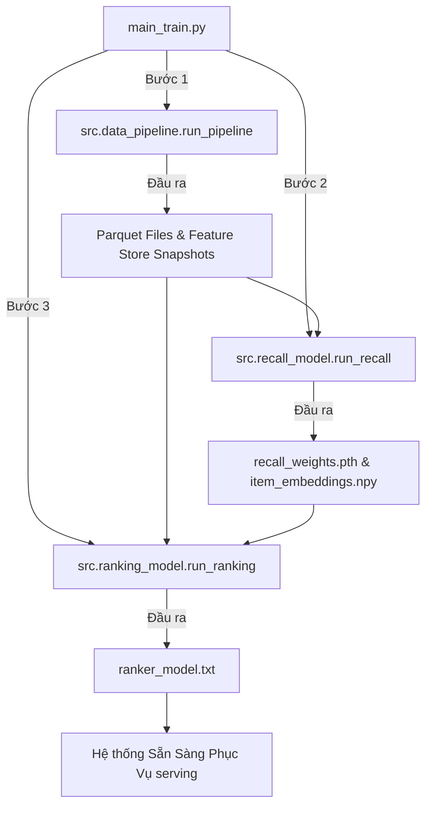

# Hướng Dẫn Tinh Chỉnh & Huấn Luyện Các Mô Hình Gợi Ý (Two-Stage Recommendation System)

Tài liệu này hướng dẫn chi tiết cách vận hành, huấn luyện và tinh chỉnh các siêu tham số (Hyperparameter Tuning) cho từng mô hình trong hệ thống gợi ý 2 giai đoạn: **Mô hình Triệu hồi (Recall - PyTorch Matrix Factorization)** và **Mô hình Xếp hạng (Ranking - LightGBM Ranker)**.

---

## 🗺️ I. Triết Lý Thiết Kế & Quy Trình Hai Giai Đoạn

Kiến trúc gợi ý hoạt động theo nguyên lý phễu lọc:
1.  **Giai đoạn Recall (Lưới lọc thô):** Quét qua hàng chục nghìn sản phẩm, sử dụng FAISS Vector Search để lấy ra 200 ứng viên tiềm năng nhất. Mục tiêu tối thượng của khâu này là **Độ phủ (High Recall / Hit Rate)** - không được bỏ sót các sản phẩm người dùng thích, độ trễ phải cực nhanh.
2.  **Giai đoạn Ranking (Lưới lọc chi tiết):** Chấm điểm và xếp hạng lại 200 ứng viên đó bằng LightGBM. Mục tiêu tối thượng của khâu này là **Độ chính xác xếp hạng (High Precision / NDCG / MRR)** - đưa các sản phẩm có khả năng mua cao nhất lên đầu tiên.

Do hai khâu có mục tiêu khác nhau, việc tinh chỉnh siêu tham số và huấn luyện cho từng mô hình cũng có những đặc thù riêng biệt.

---

## 📘 II. Tinh Chỉnh & Huấn Luyện Mô Hình Triệu Hồi (Recall Stage)

Mô hình Recall sử dụng PyTorch để phân rã ma trận **Matrix Factorization (MF)** thành các cặp User Embeddings và Item Embeddings 64 chiều, kết hợp hàm tổn thất **Focal Loss** để đối phó với dữ liệu thưa thớt (sparsity) và cực kỳ mất cân bằng.

### 1. Các Siêu Tham Số Tinh Chỉnh Quan Trọng (Tuning Hyperparameters)
Tất cả các tham số này đều được quy tụ tại `src/config.py`:

| Siêu tham số | Mặc định | Gợi ý tinh chỉnh | Ý nghĩa kỹ thuật & Tác động |
| :--- | :--- | :--- | :--- |
| `RECALL_EMBEDDING_DIM` | `64` | `32`, `128`, `256` | **Chiều rộng của vector nhúng.** <br>- *Thấp (32):* Tiết kiệm RAM, tính toán FAISS cực nhanh nhưng giảm khả năng học các mối quan hệ sở thích sâu.<br>- *Cao (128 - 256):* Mô hình học biểu diễn tốt hơn, biểu thị được các hành vi mua sắm phức tạp hơn, nhưng làm chậm tốc độ quét FAISS và tốn dung lượng bộ nhớ. |
| `RECALL_NEG_SAMPLE_RATIO`| `4` | `5` đến `10` | **Tỷ lệ mẫu âm tính (Negative Sampling Ratio).** <br>Với mỗi tương tác thực tế (Positive), ta lấy ngẫu nhiên $X$ sản phẩm mà user chưa từng tương tác làm nhãn âm. <br>- Tăng tỉ lệ này giúp mô hình học cách phân biệt tốt hơn trong môi trường thưa thớt, nhưng làm dung lượng tập huấn luyện tăng lên tương ứng. |
| `RECALL_LEARNING_RATE` | `0.01`| `0.005`, `0.001` | **Tốc độ học (Learning Rate).** <br>Tốc độ học lớn (0.01) giúp mô hình hội tụ nhanh chỉ sau vài epochs, nhưng có thể bị bỏ qua điểm tối ưu cục bộ. Nên giảm xuống nếu thấy Loss dao động mạnh không ổn định. |
| `RECALL_EPOCHS` | `5` | `10` đến `20` | **Số lượt huấn luyện.** <br>Vì sử dụng Adam Optimizer, mô hình thường hội tụ nhanh. Nếu tăng số Epochs, hãy giám sát chỉ số `Recall@50` để tránh Overfitting (mô hình chỉ gợi ý lại các sản phẩm cũ). |

### 2. Tinh Chỉnh Hàm Tổn Thất Focal Loss
Hàm tổn thất Focal Loss được khai báo tại `src/recall_model/trainer.py` dòng 43:
```python
self.criterion = FocalLoss(alpha=0.25, gamma=2.0)
```
*   **`gamma` (Mặc định 2.0):** Tham số tập trung (focusing parameter). Tăng `gamma` (ví dụ lên 3.0) sẽ ép mô hình giảm mạnh ảnh hưởng của các tương tác "dễ học" (như click/view dạo tràn lan) và tập trung toàn bộ trọng số phạt vào các tương tác "khó học" (như cart, purchase ít xuất hiện).
*   **`alpha` (Mặc định 0.25):** Tham số cân bằng lớp. Điều chỉnh để cân bằng lại tỷ lệ mất cân bằng giữa tập mẫu âm và mẫu dương.

### 3. Hướng Dẫn Huấn Luyện Thủ Công
Để chạy huấn luyện độc lập cho khâu Recall, thực hiện lệnh:
```bash
uv run python -m src.recall_model.run_recall
```
**Quy trình tự động diễn ra:**
1.  Đọc tập Parquet dữ liệu đã chia phiên.
2.  Lấy mẫu âm ngẫu nhiên theo tỷ lệ `RECALL_NEG_SAMPLE_RATIO`.
3.  Mã hóa User ID và Product ID thành các index liên tục (`LabelEncoder`).
4.  Huấn luyện PyTorch Matrix Factorization với Focal Loss qua Adam Optimizer.
5.  **Đánh giá chất lượng:** Chạy mô phỏng FAISS truy vấn tĩnh để tính toán chỉ số **Hit Rate@50 (Recall@50)** cho 500 người dùng ngẫu nhiên.
6.  Lưu trọng số mô hình (`recall_weights.pth`), ma trận nhúng sản phẩm (`item_embeddings.npy`) và các tệp ánh xạ index (`user_encoder.joblib`, `item_encoder.joblib`).

---

## 📕 III. Tinh Chỉnh & Huấn Luyện Mô Hình Xếp Hạng (Ranking Stage)

Mô hình Ranking sử dụng **LightGBM Binary Classifier** để học các cây quyết định nâng cao, kết hợp đặc trưng point-in-time lịch sử và bối cảnh phiên để dự đoán chính xác xác suất chuyển đổi (CTR/CVR).

### 1. Các Siêu Tham Số Tinh Chỉnh Quan Trọng (Tuning Hyperparameters)
Các tham số cấu hình LightGBM nằm tại `src/config.py`:

| Siêu tham số | Mặc định | Gợi ý tinh chỉnh | Ý nghĩa kỹ thuật & Tác động |
| :--- | :--- | :--- | :--- |
| `RANKING_NUM_LEAVES` | `31` | `15`, `63`, `127` | **Số lượng lá tối đa trên mỗi cây quyết định.** <br>- *Thấp (15):* Cây nông, chống overfitting rất tốt, suy luận cực nhanh.<br>- *Cao (63 - 127):* Cây sâu, cho phép LightGBM học các mối quan hệ đặc trưng tương tác phi tuyến cực kỳ phức tạp (ví dụ sự kết hợp giữa price, brand và hành vi tương tác phiên), nhưng dễ gây overfitting nếu tập dữ liệu nhỏ. |
| `RANKING_NUM_BOOST_ROUND`| `100` | `200` đến `1000`| **Số lượng cây quyết định cần huấn luyện (Boosting rounds).** <br>Tăng số lượng cây kết hợp với giảm `RANKING_LEARNING_RATE` giúp mô hình đạt độ chính xác tối ưu. |
| `RANKING_LEARNING_RATE` | `0.05`| `0.01` đến `0.03`| **Tốc độ học của cây.** <br>Giảm tốc độ học giúp mô hình học mịn hơn và không bị vọt qua điểm tối ưu. Thường đi đôi với việc tăng số cây `RANKING_NUM_BOOST_ROUND`. |
| `RANKING_TEST_SIZE` | `0.2` | `0.1` đến `0.25` | **Tỷ lệ tập kiểm thử phân tách theo thời gian (Time-based Split).** |

### 2. Tinh Chỉnh Trọng Số Mẫu (Sample Weights) & Cân Bằng Lớp
Mô hình Ranking được cấu hình chống mất cân bằng bằng 2 cơ chế cực kỳ mạnh mẽ trong `src/ranking_model/lgbm_train.py` và `src/data_pipeline/pseudo_label.py`:

*   **`is_unbalance=True` (Cấu hình tại dòng 26 của `lgbm_train.py`):**
    ```python
    "is_unbalance": True
    ```
    Thuộc tính này báo cho LightGBM tự động tính toán lại trọng số lớp dựa trên tỷ lệ tần suất xuất hiện của nhãn 0 và nhãn 1 trong tập huấn luyện.
*   **`sample_weight` (Trọng số tương tác Implicit):**
    Trong `pseudo_label.py`, điểm tương tác implicit được gán: `view=0.1`, `cart=0.5`, `purchase=1.0`. Nhãn này sau đó được ánh xạ trực tiếp thành trọng số huấn luyện (`sample_weight`). 
    *   *Mẹo tinh chỉnh:* Nếu muốn hệ thống ưu tiên tuyệt đối việc gợi ý sản phẩm **để mua** thay vì sản phẩm chỉ để **xem**, bạn có thể tăng trọng số của `purchase` lên cao hơn nữa (ví dụ: `view=0.05`, `cart=0.5`, `purchase=2.0` hoặc `3.0`).

### 3. Hướng Dẫn Huấn Luyện Thủ Công
Để chạy huấn luyện độc lập cho khâu Ranking, thực hiện lệnh:
```bash
uv run python -m src.ranking_model.run_ranking
```
**Quy trình tự động diễn ra:**
1.  Đọc bảng tương tác lịch sử và nạp hai bảng đặc trưng snapshot từ Feature Store (`user_features.parquet`, `item_features.parquet`).
2.  Thực hiện phép nối (Merge) để tạo bảng dữ liệu phẳng chứa toàn bộ đặc trưng.
3.  Tự động nạp danh sách đặc trưng số học (`NUMERICAL_FEATURES`) và danh mục (`CATEGORICAL_FEATURES`) trực tiếp từ cấu hình `config.py` (đảm bảo đồng bộ tuyệt đối).
4.  Áp dụng **Time-based Splitting**: Sắp xếp dữ liệu theo `event_time`, cắt 80% thời gian đầu làm tập Train, 20% thời gian sau làm tập Test để chống rò rỉ thông tin tương lai.
5.  Huấn luyện LightGBM.
6.  **Đánh giá chất lượng xếp hạng:** Sử dụng tập kiểm thử Test, gom nhóm các ứng viên theo từng `user_id` và đánh giá qua hai chỉ số xếp hạng chuẩn công nghiệp là **NDCG@10** và **MRR**.
7.  Lưu mô hình nhị phân thành công ra đĩa cứng tại `models_store/ranker_model.txt`.

---

## ⚡ IV. Quy Trình Huấn Luyện End-to-End Tự Động (Automated Pipeline)

Để đơn giản hóa tối đa quy trình vận hành, hệ thống tích hợp sẵn một tập lệnh điều phối toàn bộ chu trình từ tiền xử lý dữ liệu thô, huấn luyện Recall, xuất đặc trưng cho đến huấn luyện Ranking chỉ bằng **một câu lệnh duy nhất**:

```bash
uv run python main_train.py
```

### Sơ đồ chu trình tự động của `main_train.py`:


---

## 💡 V. Chiến Thuật Vàng Để Tinh Chỉnh Mô Hình Đạt Hiệu Năng Cao (Tips & Tricks)

Khi bạn muốn cải thiện độ chính xác gợi ý và tối ưu hóa độ trễ phục vụ, hãy tham khảo các chiến thuật dưới đây:

### 1. Tối Ưu Độ Trễ (Latency Tuning)
*   **FAISS Search:** Nếu thấy độ trễ tìm kiếm FAISS tăng cao, hãy kiểm tra kích thước `RECALL_TOP_K_LONG_TERM` và `RECALL_TOP_K_SESSION` trong `config.py`. Giảm từ `100` xuống `50` hoặc `30` sẽ giảm lượng ứng viên truyền qua LightGBM xuống rất nhiều, giúp tốc độ chấm điểm của Ranker tăng gấp đôi.
*   **Tránh tốn RAM:** Bảng đặc trưng `user_features.parquet` and `item_features.parquet` nạp trực tiếp vào RAM lúc khởi động API. Bạn hãy định kỳ làm sạch tập dữ liệu thô cũ để loại bỏ các user quá hạn không còn hoạt động, giữ bảng RAM Feature Store luôn tinh gọn.

### 2. Tinh Chỉnh Tăng Độ Chính Xác Gợi Ý (Accuracy Tuning)
*   **Bổ sung Đặc trưng Categorical:** Các đặc trưng phân mục như `category_code` và `brand` đóng vai trò rất quan trọng cho bộ xếp hạng LightGBM. Hãy đảm bảo dữ liệu thô của bạn chứa đầy đủ thông tin này để mô hình khai thác mối quan hệ tương quan (ví dụ: người dùng thường mua hàng cùng một hãng điện thoại ưa thích).
*   **Mẹo tránh Overfitting cho LightGBM:** 
    Nếu bạn tăng `RANKING_NUM_LEAVES` lên trên `63`, hãy chú ý điều chỉnh thêm tham số `min_data_in_leaf` (mặc định 20, có thể nâng lên 50 hoặc 100 trong `lgbm_train.py`) để ngăn chặn việc thuật toán tạo ra các nhánh cây quá chi tiết chỉ khớp với một vài mẫu nhiễu.
